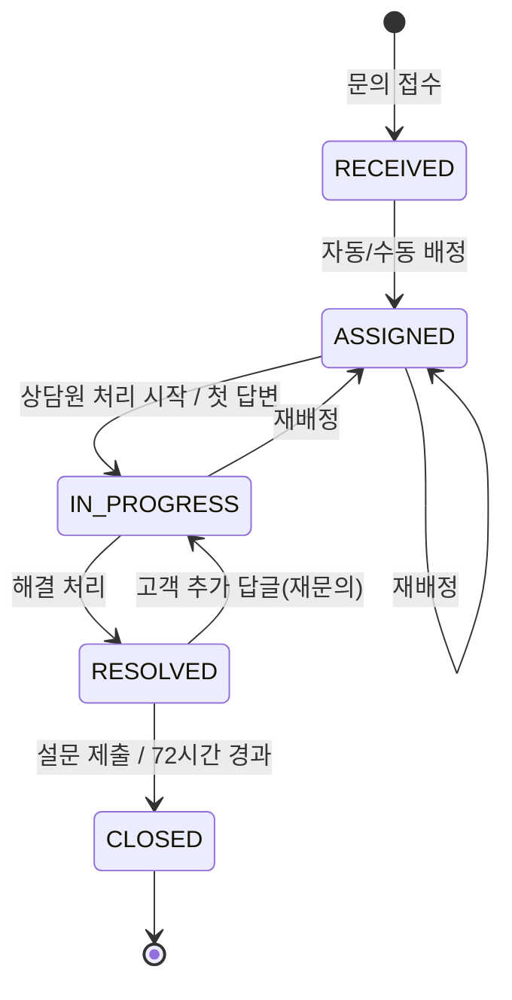

# HelpNest PRD (Product Requirements Document)

| 항목 | 내용 |
|---|---|
| 제품명(가칭) | HelpNest — AI 고객상담(CS) 헬프데스크 · 티켓 관리 시스템 |
| 문서 버전 | v1.5 (2026-09-29) — 담당자 실명, 누락 기능 7종, 디자인·화면·컨벤션/CI 문서, IDE 통일, Q1~Q19 확정(Q9 Amplify), JWT 보관·티켓번호·재문의 설문·채팅 전이 보완, SurveyPort 삭제, 최종 오탈자·표 깨짐 점검, 확정 버전(Next.js 16.3.x·Boot 4.1.1·Spring AI 2.0.1), Q20 CloudFront·Q21 REST 프록시 |
| 개발 기간 | 2026-09-29(화) ~ 2026-10-21(수), 약 3주 |
| 팀 | 3명 — 백성준(BSJ), 박민재(PMJ), 신수진(SSJ) — 각자 Claude Code로 담당 영역 개발 |
| 관련 문서 | [협업 규칙](docs/01_collaboration-rules.md) · [아키텍처](docs/02_architecture.md) · [DB](docs/03_database.md) · [API](docs/04_api-spec.md) · [AI](docs/05_ai-automation.md) · [로드맵](docs/06_roadmap.md) · [Shrimp 가이드](docs/07_shrimp-task-guide.md) · [디자인 시스템](docs/08_design-system.md) · [화면 명세](docs/09_screen-spec.md) · [컨벤션·CI](docs/10_coding-conventions.md) |

---

## 0. 최우선 규칙 (Golden Rules)

> 모든 기능 요구사항보다 **우선**한다. Shrimp Task Manager의 모든 태스크 완료 조건에도 포함한다.

| # | 규칙 | 상세 |
|---|---|---|
| **R1** | **push 전 pull 확인** | `git fetch origin` → `git status`로 behind 여부 확인 → behind면 `git pull` → 충돌 해결·빌드 확인 후 `git push`. `origin/dev`에 새 커밋이 있으면 feature 브랜치에 먼저 반영한다. |
| **R2** | **본인 파일만 수정** | 내가 만들지 않은 파일은 수정하지 않는다. 필요한 변경은 GitHub Issue(`change-request` 라벨)로 소유자에게 요청한다. 공용 파일은 백성준 소유. |
| **R3** | **머지 순서 고정** | `feature/{이니셜}-{기능}` → `dev` → `main`. 모든 머지는 PR로 진행하며 `dev`/`main` 직접 push·force push 금지. |
| **R4** | **로컬 DB** | AWS 배포 전까지 DB는 각자 로컬 PostgreSQL(docker-compose)로 개발·테스트한다. |
| **R5** | **계약 우선** | 다른 담당자의 도메인은 [아키텍처 문서](docs/02_architecture.md)의 이벤트/포트 계약과 [API 명세](docs/04_api-spec.md)로만 연동한다. |
| **R6** | **디자인 토큰·공용 UI만 사용** | 페이지에서 색상 hex/임의 Tailwind 팔레트(`bg-indigo-600` 등) 직접 사용 금지. [디자인 시스템](docs/08_design-system.md)의 토큰 클래스와 `components/ui`(shadcn, 백성준 소유)만 사용한다. |

---

## 1. 개요

### 1.1 배경
CS는 고객과 기업 사이의 가장 작은 단위(마이크로)의 소통이다. 문의가 이메일·전화·게시판으로 흩어지면 누락, 응답 지연, 담당자 편중이 생긴다. HelpNest는 모든 문의를 **티켓**으로 모으고, **AI가 분류·우선순위·답변 초안**을 만들어 상담원의 처리 시간을 줄인다.

### 1.2 목표
| 목표 | 측정 지표 (MVP 시연 기준) |
|---|---|
| 문의 누락 0 | 접수된 모든 문의가 티켓 번호로 추적되고 상태 이력이 남는다 |
| 응답 지연 감소 | SLA 임박(80%)·초과 시 실시간 알림, 대시보드에서 SLA 위반율 확인 |
| 상담원 처리 시간 단축 | AI 분류 자동 반영, 답변 초안 1클릭 생성 → 수정 후 발송 |
| 고객 경험 측정 | 해결 시 결과 메일 + 만족도 설문 자동 발송, 평균 만족도 집계 |

### 1.3 기획서 대비 변경 사항
| 기획서 | 본 PRD | 사유 |
|---|---|---|
| Oracle 시간 함수로 SLA·평균 처리시간 계산 | **PostgreSQL** 시간 함수(`NOW()`, `INTERVAL`, `EXTRACT(EPOCH FROM ...)`, `date_trunc`, `AVG(interval)`)로 계산 | DB를 PostgreSQL로 확정 |
| 선택 기능(채팅/이력 묶음/월간 리포트) | **MVP에 모두 포함** | 팀 결정 |
| 핵심 테이블 8개 | 8개 + 보조 테이블(REFRESH_TOKEN, PASSWORD_RESET_TOKEN, TICKET_AI_RESULT, AI_DRAFT, SLA_POLICY, NOTIFICATION, CHAT_ROOM, CHAT_MESSAGE, MAIL_LOG) | 파일/테이블 소유권 분리 및 기능 구현에 필요 ([DB 문서](docs/03_database.md)) |

---

## 2. 사용자 및 권한

| 역할 | 코드 | 설명 |
|---|---|---|
| 비회원 고객 | `GUEST` (토큰 없음) | 이름·이메일·조회 비밀번호로 문의 접수, 티켓번호+이메일+비밀번호로 조회 |
| 회원 고객 | `CUSTOMER` | 회원가입 후 문의 접수, 내 문의 목록, 1:1 채팅 |
| 상담원 | `AGENT` | 배정된 티켓 처리, 답변(AI 초안 활용), 템플릿 사용, 본인 처리현황 조회 |
| 상담팀장 | `LEAD` | 전체 티켓 조회, 수동 배정/재배정, 템플릿·FAQ 관리, 전체 대시보드·리포트 |
| 최고관리자 | `ADMIN` | 계정·권한 관리, SLA 정책 설정, LEAD 권한 전체 |

### 2.1 권한 매트릭스
| 기능 | GUEST | CUSTOMER | AGENT | LEAD | ADMIN |
|---|:-:|:-:|:-:|:-:|:-:|
| 문의 접수(파일 첨부) | ✅ | ✅ | - | - | - |
| 비밀번호 찾기/변경·내 정보 수정 | 조회 비밀번호 재설정 | ✅ | ✅ | ✅ | ✅ |
| 상담원 답변 알림 수신 | 메일 | 메일+웹 | - | - | - |
| 내 문의 조회/추가 답글 | ✅(조회 인증) | ✅ | - | - | - |
| FAQ 조회 | ✅ | ✅ | ✅ | ✅ | ✅ |
| 만족도 설문 응답 | ✅(토큰) | ✅(토큰) | - | - | - |
| 1:1 실시간 채팅 | - | ✅ | ✅ | ✅ | - |
| 배정된 티켓 처리/답변 | - | - | ✅ | ✅ | ✅ |
| 전체 티켓 조회 | - | - | 본인 배정분 | ✅ | ✅ |
| 수동 배정/재배정 | - | - | - | ✅ | ✅ |
| AI 재분류 / 답변 초안 | - | - | ✅ | ✅ | ✅ |
| FAQ·템플릿 관리 | - | - | 조회 | ✅ | ✅ |
| 대시보드 | - | - | 본인 | 전체 | 전체 |
| 월간 리포트 (CSV 다운로드 포함) | - | - | - | ✅ | ✅ |
| 설문 결과 조회 | - | - | 본인 티켓 | ✅ | ✅ |
| 계정/권한·SLA 정책 관리 | - | - | - | - | ✅ |

---

## 3. 범위

### 3.1 필수 기능 (MVP)
1. 고객 문의 접수 (웹 폼 + 파일 첨부, 회원/비회원)
2. 티켓 상태 관리 (접수 → 배정 → 처리중 → 해결 → 종료)
3. 상담원 자동(최소 부하)/수동 배정
4. 답변 템플릿 · FAQ 관리
5. SLA(첫 응답 기한) 임박/초과 알림
6. 만족도 설문
7. 상담원별 처리현황 대시보드

### 3.2 선택 기능 (MVP 포함)
8. WebSocket 실시간 1:1 채팅 상담
9. 동일 고객 문의 이력 묶음
10. 문의 유형별 월간 리포트

### 3.2-1 추가 기능 (v1.1, MVP 포함)
11. 설문 결과 조회 화면 (백성준)
12. 고객 답변 알림 — 상담원 공개 답변 시 메일(전원) + 웹 알림(회원) (박민재·신수진)
13. 계정 편의 — 비밀번호 찾기·변경, 내 정보 수정, 비회원 조회 비밀번호 재설정 (백성준)
14. 리포트·대시보드 CSV 다운로드 (신수진)
15. 채팅 대기열 + 시간 초과 시 문의 티켓 전환 (박민재)
16. 비회원 문의 스팸 방지 — IP·이메일 요청 제한 (백성준, 공용 필터)
17. 답변 에디터 일반 텍스트 방식 확정 (박민재)

### 3.3 AI Automation
- **AI-1** 문의 내용을 LLM이 유형·긴급도·감정(불만 여부)으로 자동 분류
- **AI-2** FAQ·과거 답변을 참고한 답변 초안 생성 → 상담원이 수정 후 발송
- **AI-3** 해결 시 고객에게 결과 메일·만족도 설문 자동 발송

### 3.4 범위 외 (Out of Scope)
- 전화/카카오톡 등 외부 채널 연동, 다국어, 결제/주문 시스템 연동, 모바일 앱
- 소셜 로그인, 이메일 인증 회원가입 (필요 시 추후)

---

## 4. 기능 요구사항

> 우선순위: P0(필수) / P1(선택 MVP) · 담당: 백성준 / 박민재 / 신수진

### 4.1 인증·회원 (백성준)
| ID | 요구사항 | 우선 |
|---|---|:-:|
| FR-AUTH-01 | 이메일/비밀번호 회원가입(CUSTOMER), 로그인 시 JWT Access(30분) + Refresh(14일) 발급. **Access는 응답 본문 → 프론트 메모리에만 보관**, **Refresh는 `httpOnly`·`Secure`·`SameSite=Lax` 쿠키**(`Path=/`)로만 전달 — JS에서 읽을 수 없음. 새로고침 시 `/api/auth/refresh`로 Access 복구 | P0 |
| FR-AUTH-02 | Refresh 토큰으로 재발급, 로그아웃 시 Refresh 토큰 폐기 | P0 |
| FR-AUTH-03 | ADMIN이 AGENT/LEAD 계정 생성, 역할 변경, 비활성화 | P0 |
| FR-AUTH-04 | 역할 기반 접근 제어(Spring Security + 프론트 라우트 가드). 프론트는 클라이언트 `AuthGuard`가 기본(새로고침 시 refresh 성공 여부로 판단). Next.js `proxy.ts`(Next 16 의 middleware)는 Refresh 쿠키 유무로 1차 확인(REST가 Next.js 프록시를 거쳐 쿠키가 프론트 도메인 쿠키가 되므로 가능) |  P0 |
| FR-AUTH-05 | 상담원 상담 가능 상태(`available`) ON/OFF — 자동 배정 대상 여부 | P0 |
| FR-AUTH-06 | 비회원 티켓 조회: 티켓번호 + 이메일 + 조회 비밀번호 → 해당 티켓 전용 Guest 토큰(30분) 발급, Access와 같이 **메모리 보관**(새로고침 시 다시 조회) | P0 |
| FR-AUTH-07 | 비밀번호 찾기: 이메일 입력 → 재설정 링크 메일(유효 30분, 1회용) → 새 비밀번호 설정. 가입 여부와 무관하게 동일 응답(계정 존재 노출 방지) | P0 |
| FR-AUTH-08 | 비밀번호 변경(현재 비밀번호 확인), 내 정보 수정(이름·연락처). 비밀번호 변경 시 모든 Refresh 토큰 폐기 | P0 |
| FR-AUTH-09 | 비회원 조회 비밀번호 재설정: 티켓번호 + 이메일 → 재설정 링크 메일 → 새 조회 비밀번호 (`TicketGuestPort`로 반영) | P0 |

### 4.2 문의 접수·첨부 (백성준: 화면·첨부 / 박민재: 티켓 생성 API)
| ID | 요구사항 | 우선 |
|---|---|:-:|
| FR-INQ-01 | 문의 폼: 제목, 내용, (선택)고객 선택 유형, 첨부파일 / 비회원은 이름·이메일·조회 비밀번호 추가 | P0 |
| FR-INQ-02 | 첨부: 파일당 10MB, 최대 5개, 이미지/PDF/문서 확장자 화이트리스트 | P0 |
| FR-INQ-03 | 접수 완료 시 티켓번호 안내 — 형식 `HN-{접수일 yyyyMMdd}-{전체 일련번호 6자리}` (예: `HN-20261002-000123`). 일련번호는 DB 시퀀스 `ticket_no_seq`로 발급해 동시 접수에도 중복 없음(매일 1부터 다시 시작하지 않음) | P0 |
| FR-INQ-04 | 회원 "내 문의" 목록/상세, 고객 추가 답글 | P0 |
| FR-INQ-05 | 접수 폼 입력 중 제목 키워드로 관련 FAQ 추천 | P1 |
| FR-INQ-06 | 스팸 방지(백성준, 공용 `RateLimitFilter`): 비회원 문의·첨부 업로드는 동일 IP(프록시 경유이므로 `X-Forwarded-For`의 클라이언트 IP 기준) 10분 5건, 동일 이메일 1시간 5건 초과 시 `429 COMMON_TOO_MANY_REQUESTS`. 로그인·비밀번호 찾기도 IP 기준 제한 | P0 |

### 4.3 티켓·상태 전이 (박민재)
| ID | 요구사항 | 우선 |
|---|---|:-:|
| FR-TKT-01 | 상담 콘솔 티켓 목록: 상태/우선순위/유형/담당자/SLA 상태 필터, 정렬(SLA 임박 순) | P0 |
| FR-TKT-02 | 티켓 상세: 본문, 첨부, 답변 타임라인, 상태 이력, AI 분석 패널(신수진 컴포넌트), 고객 이력(백성준 컴포넌트) | P0 |
| FR-TKT-03 | 상태 전이는 **서비스 계층에서 검증**(5장 전이표). 불허 전이 시 `TICKET_INVALID_TRANSITION` 에러 | P0 |
| FR-TKT-04 | 모든 상태 변경·배정·우선순위 변경을 TICKET_HISTORY에 기록 | P0 |
| FR-TKT-05 | 상담원 답변(고객 공개) / 내부 메모(비공개) 구분, 템플릿 삽입, AI 초안 삽입 | P0 |
| FR-TKT-06 | 첫 상담원 공개 답변 시 `first_responded_at` 기록 (SLA 충족 판정) | P0 |
| FR-TKT-07 | 답변·문의 본문은 **일반 텍스트**(textarea). 저장은 원문 그대로, 화면 출력 시 HTML 이스케이프 + 줄바꿈 유지(`white-space: pre-wrap`), URL만 자동 링크. 최대 5,000자 | P0 |

### 4.4 배정 (박민재)
| ID | 요구사항 | 우선 |
|---|---|:-:|
| FR-ASN-01 | 자동 배정: AI 분류 완료(또는 실패 fallback) 직후 **최소 부하** 상담원에게 배정 (6.2) | P0 |
| FR-ASN-02 | 수동 배정/재배정: LEAD/ADMIN이 상담원 선택, 사유 메모 | P0 |
| FR-ASN-03 | 배정 시 해당 상담원에게 실시간 알림 | P0 |

### 4.5 SLA·알림 (박민재)
| ID | 요구사항 | 우선 |
|---|---|:-:|
| FR-SLA-01 | 우선순위별 첫 응답 기한 자동 계산 (6.1) | P0 |
| FR-SLA-02 | 스케줄러(1분 주기)가 기한 80% 경과 시 `SLA_WARNING`, 초과 시 `SLA_BREACHED` 알림 (담당 상담원 + LEAD) | P0 |
| FR-SLA-03 | 초과 티켓 `sla_breached = true`, 목록에 배지 표시 | P0 |
| FR-SLA-04 | ADMIN이 SLA 정책(우선순위별 분) 수정 | P0 |
| FR-NTF-01 | 알림 종류: 신규 배정, SLA 임박/초과, 고객 추가 답글, 상태 변경 — WebSocket 실시간 + NOTIFICATION 저장 | P0 |
| FR-NTF-02 | 헤더 알림 벨: 미읽음 수, 목록, 읽음 처리 | P0 |
| FR-NTF-03 | **고객 답변 알림**: 상담원이 공개 답변을 등록하면 고객에게 메일(답변 앞 200자 + 문의 보기 링크, 신수진 `MailSender`) 발송. 회원은 웹 알림(`AGENT_REPLY`)도 저장·푸시. 내부 메모는 알림 없음. 같은 티켓에 10분 내 연속 답변 시 메일은 1회로 묶음 | P0 |

### 4.6 FAQ·템플릿 (백성준)
| ID | 요구사항 | 우선 |
|---|---|:-:|
| FR-FAQ-01 | 고객용 FAQ 목록(유형별 탭, 키워드 검색), 조회수 | P0 |
| FR-FAQ-02 | LEAD/ADMIN FAQ CRUD, 공개/비공개 | P0 |
| FR-TPL-01 | LEAD/ADMIN 답변 템플릿 CRUD(유형, 제목, 본문, `{고객명}`·`{티켓번호}` 치환 변수) | P0 |
| FR-TPL-02 | 상담원 답변 작성 시 유형별 템플릿 검색·삽입 (박민재 화면에서 백성준 컴포넌트 사용) | P0 |

### 4.7 만족도 설문 (백성준) · 메일 (신수진)
| ID | 요구사항 | 우선 |
|---|---|:-:|
| FR-SRV-01 | 티켓 `RESOLVED` 시 설문 토큰 생성(유효 72시간) | P0 |
| FR-SRV-02 | 결과 메일(답변 요약 + 설문 링크) 자동 발송 — **AI-3** | P0 |
| FR-SRV-03 | 설문 페이지: 별점 1~5 + 의견, 1회만 제출 → 제출 시 티켓 `CLOSED` | P0 |
| FR-SRV-04 | 설문 미응답 72시간 경과 시 티켓 자동 `CLOSED` (박민재 스케줄러) | P0 |
| FR-SRV-06 | **재문의 처리**: RESOLVED 티켓이 고객 답글로 IN_PROGRESS가 되면 미제출 설문은 즉시 만료. 다시 RESOLVED가 되면 같은 SURVEY 행을 새 토큰·새 만료시각으로 **재발급**하고 결과 메일 재발송 (티켓당 설문 1개 유지) | P0 |
| FR-SRV-05 | **설문 결과 조회**(LEAD/ADMIN 전체, AGENT 본인 담당분): 기간·별점·상담원·유형 필터, 목록(티켓번호, 고객, 상담원, 별점, 의견, 제출일), 상단 요약(응답률, 평균 별점, 별점 분포), 행 클릭 시 티켓 상세 이동 | P0 |

### 4.8 AI (신수진)
| ID | 요구사항 | 우선 |
|---|---|:-:|
| FR-AI-01 | 티켓 생성 후 비동기로 LLM 분류: 유형, 긴급도, 감정, 요약, 신뢰도 → TICKET_AI_RESULT 저장 → 티켓에 반영 | P0 |
| FR-AI-02 | 감정 `NEGATIVE`(불만)이면 우선순위 1단계 상향 (최대 URGENT), 목록에 불만 배지 | P0 |
| FR-AI-03 | 상담원 "AI 재분류" 버튼, 상담원이 분류 결과를 수동 수정 가능(수정 이력 남김) | P0 |
| FR-AI-04 | 답변 초안 생성: 동일 유형 FAQ + 과거 해결 답변 Top-N을 컨텍스트로 LLM 호출 → 상담원이 편집 후 발송 | P0 |
| FR-AI-05 | LLM 실패/타임아웃(10초) 시 기본값(유형 `ETC`, 우선순위 `NORMAL`)으로 fallback, 수동 분류 유도 | P0 |
| FR-AI-06 | LLM 제공자는 설정으로 교체 가능하도록 추상화 (Spring AI) | P0 |

### 4.9 대시보드·리포트 (신수진)
| ID | 요구사항 | 우선 |
|---|---|:-:|
| FR-DSH-01 | 상담원별: 배정/처리중/오늘 해결 건수, 평균 첫 응답시간, 평균 해결시간, SLA 위반율, 평균 만족도 | P0 |
| FR-DSH-02 | 팀 전체 KPI 카드 + 상태별/유형별 분포 차트, 기간 필터(오늘/7일/30일) | P0 |
| FR-DSH-03 | AGENT는 본인 지표만, LEAD/ADMIN은 전체 | P0 |
| FR-RPT-01 | 월간 리포트: 유형별 건수·전월 대비, 평균 처리시간, SLA 위반율, 만족도, 불만 비율 | P1 |
| FR-RPT-02 | **CSV 다운로드**: 월간 리포트, 상담원별 처리현황 표를 CSV로 내려받기 (UTF-8 BOM 포함 → 엑셀에서 한글 깨짐 없이 열림). 파일명 `helpnest_report_2026-10.csv` | P1 |

### 4.10 실시간 채팅 (박민재) · 이력 묶음 (백성준)
| ID | 요구사항 | 우선 |
|---|---|:-:|
| FR-CHT-01 | 회원 고객이 채팅 시작 → 채팅방 `WAITING` 생성 → 상담 가능 상담원이 있으면 최소 부하 상담원 배정 → `OPEN` + `channel=CHAT` 티켓 생성(ASSIGNED) | P1 |
| FR-CHT-02 | STOMP 실시간 메시지 송수신, 메시지 저장, 재접속 시 이전 메시지 로드 | P1 |
| FR-CHT-03 | 상담원이 채팅 종료 시 티켓 `RESOLVED` 전환 가능 | P1 |
| FR-CHT-04 | **대기열**: 상담원이 없으면 대기 순번을 실시간 표시(`/user/queue/chat-status`). 상담원이 가능해지면 대기 순서(FIFO)대로 자동 연결 | P1 |
| FR-CHT-05 | **시간 초과 전환**: 대기 5분 경과 시 "문의로 남기기 / 계속 기다리기 / 나가기" 안내. 문의로 남기기 → 대기 중 입력한 메시지를 본문으로 일반 티켓 생성(RECEIVED, `channel=CHAT`) → 방 `CONVERTED`. 나가기 → `CANCELED`(티켓 미생성) | P1 |
| FR-CHT-06 | CHAT 티켓은 **상담원의 첫 채팅 메시지** 시 `first_responded_at` 기록 + `ASSIGNED → IN_PROGRESS` 전환(그래야 채팅 종료 시 RESOLVED 전이가 가능하고 SLA 오탐도 없음). CHAT 티켓도 AI 분류는 수행하되 **이미 배정된 티켓은 재배정하지 않음** | P1 |
| FR-HIS-01 | 동일 고객(회원 ID, 비회원은 이메일 기준)의 과거 문의를 티켓 상세 사이드 패널에 묶어서 표시 | P1 |
| FR-HIS-02 | 고객 단위 이력 화면: 전체 문의 수, 최근 문의, 평균 만족도 | P1 |

---

## 5. 티켓 상태 전이

| 현재 \ 다음 | ASSIGNED | IN_PROGRESS | RESOLVED | CLOSED | 수행자 |
|---|:-:|:-:|:-:|:-:|---|
| RECEIVED | ✅ | ❌ | ❌ | ❌ | SYSTEM(자동배정), LEAD/ADMIN |
| ASSIGNED | ✅(재배정) | ✅ | ❌ | ❌ | 담당 AGENT, LEAD/ADMIN |
| IN_PROGRESS | ✅(재배정) | - | ✅ | ❌ | 담당 AGENT, LEAD/ADMIN |
| RESOLVED | ❌ | ✅(고객 답글) | - | ✅ | SYSTEM, CUSTOMER |
| CLOSED | ❌ | ❌ | ❌ | - | 종료(불변) |

- 검증 위치: `TicketStateMachine`(박민재) — 컨트롤러가 아닌 **서비스 계층**에서 `from → to` 허용 여부 + 수행자 권한을 함께 검증
- 전이 성공 시: TICKET_HISTORY 기록 → `TicketStatusChangedEvent` 발행 (`RESOLVED`면 백성준 설문 생성 → 신수진 메일 발송)

---

## 6. 정책

### 6.1 SLA (첫 응답 기한, 우선순위별 고정 — ADMIN 수정 가능)
| 우선순위 | 첫 응답 기한 | 임박 알림(80%) |
|---|---|---|
| URGENT | 1시간 | 48분 경과 |
| HIGH | 4시간 | 3시간 12분 경과 |
| NORMAL | 24시간 | 19시간 12분 경과 |
| LOW | 48시간 | 38시간 24분 경과 |

- 기한 = `created_at + response_minutes * INTERVAL '1 minute'` (PostgreSQL)
- AI 분류로 우선순위가 바뀌면 `first_response_due_at` 재계산
- 영업시간/휴일 제외 계산은 범위 외 (24시간 기준)

### 6.2 자동 배정 — 최소 부하
1. 대상: `role = AGENT` AND `status = ACTIVE` AND `available = true`
2. 부하 = 해당 상담원의 `ASSIGNED + IN_PROGRESS` 티켓 수
3. 부하가 가장 적은 상담원 → 동률이면 마지막 배정 시각이 가장 오래된 상담원
4. 대상 상담원이 없으면 `RECEIVED` 유지 + LEAD에게 `UNASSIGNED` 알림
5. 동시성: 배정 트랜잭션에서 티켓 행 `SELECT ... FOR UPDATE`(비관적 락)로 중복 배정 방지
6. 자동 배정은 `status = RECEIVED`인 티켓에만 수행 (채팅으로 이미 배정된 티켓에 `applyClassification`이 와도 우선순위·SLA만 갱신)

---

## 7. 비기능 요구사항
| 구분 | 요구사항 |
|---|---|
| 성능 | 일반 API p95 < 500ms (AI 호출 제외), AI 분류는 비동기로 접수 응답을 지연시키지 않음 |
| 보안 | BCrypt 비밀번호, JWT 서명키·API 키는 환경변수, CORS는 프론트 도메인만 허용, 첨부 확장자/크기 검증, LLM 전송 전 전화번호·이메일 마스킹, 요청 횟수 제한(FR-INQ-06), 일반 텍스트 출력 시 HTML 이스케이프(FR-TKT-07), 재설정 토큰은 해시 저장·1회용 |
| UI 일관성 | 모든 화면은 디자인 토큰·공용 UI 컴포넌트·공통 상태 패턴(로딩/빈/에러) 사용 ([08](docs/08_design-system.md)) |
| 신뢰성 | LLM/메일 실패 시 기능 전체가 멈추지 않도록 fallback + MAIL_LOG 재시도 기록 |
| 감사 | 티켓 상태·배정·AI 분류 수정 모두 이력 저장 |
| 시간 | DB `TIMESTAMPTZ`, 서버/DB 타임존 `Asia/Seoul` 표시 |
| 테스트 | 상태 전이·배정·SLA 계산 서비스 단위 테스트 필수, dev 머지 전 로컬 빌드/테스트 통과 |

---

## 8. 기술 스택 요약
| 영역 | 기술 |
|---|---|
| Frontend | Next.js 16.3.x 최신 안정(App Router, TypeScript, Node 22 LTS), Tailwind CSS + **shadcn/ui**(공용 UI, 백성준 소유), lucide 아이콘, STOMP 클라이언트(@stomp/stompjs), 차트 라이브러리 |
| 디자인 | 브랜드 톤 **퍼플/인디고(AI 강조)**, 디자인 토큰 기반 — 세부 값은 마지막에 일괄 조정 ([디자인 시스템](docs/08_design-system.md)) |
| AI 개발 보조 | 공용 Claude Code agent·skill은 front repo `.claude/`에 커밋 (백성준 소유) |
| CI | GitHub Actions — dev·main 대상 PR에서만 빌드/테스트 ([컨벤션·CI](docs/10_coding-conventions.md)) |
| Backend | Spring Boot **4.1.1**, Java 21, **Maven**, Spring Security + JWT, **Spring Data JPA**, Spring WebSocket(STOMP), Spring AI **2.0.1**, `@Scheduled` |
| DB | PostgreSQL (로컬: docker-compose / 배포: AWS RDS) |
| AWS | S3(첨부), SES(메일), EC2·RDS(백엔드), **Amplify Hosting(프론트)** — **배포 단계에서 신수진이 연결** |
| 협업 | GitHub(3 repo, https://github.com/BaekSeongJun, Public), Claude Code, Shrimp Task Manager |

> 확정 버전 표(Next.js·Node·Spring Boot·Spring AI·PostgreSQL)는 [아키텍처 문서 §1](docs/02_architecture.md#1-기술-스택-백성준) 참고.

---

## 9. 역할 분담 (소유권)
| 담당 | Frontend 페이지 | Backend 도메인 | 테이블 |
|---|---|---|---|
| **백성준** (BSJ) | 공용 레이아웃(Header·Sidebar·Footer), **디자인 토큰·`components/ui`(shadcn)·공용 배지**, 로그인/회원가입, **비밀번호 찾기·변경·내 정보**, 문의 접수, 비회원 조회(+재설정), 내 문의, FAQ, 설문, **설문 결과 조회**, 관리자(계정/FAQ/템플릿), 고객 이력 패널, `.claude/` agent·skill | `global/*`(보안·공통·설정·**RateLimitFilter**), auth, member, attachment, faq, template, survey, customer(이력) | MEMBER, REFRESH_TOKEN, **PASSWORD_RESET_TOKEN**, ATTACHMENT, FAQ, TEMPLATE, SURVEY |
| **박민재** (PMJ) | 상담 콘솔 티켓 목록/상세, 알림 벨, 채팅(고객/상담원, **대기열**), SLA 정책 관리 | ticket, assignment, sla, notification(**고객 답변 알림** 포함), chat, WebSocket 설정 | TICKET, TICKET_HISTORY, TICKET_REPLY, SLA_POLICY, NOTIFICATION, CHAT_ROOM, CHAT_MESSAGE |
| **신수진** (SSJ) | AI 분석/초안 패널 컴포넌트, 대시보드, 월간 리포트(**CSV**) | ai, dashboard, report, infra(storage/mail/llm), 배포 설정, **CI 워크플로** | TICKET_AI_RESULT, AI_DRAFT, MAIL_LOG |

세부 파일 단위 소유권은 [협업 규칙 §4](docs/01_collaboration-rules.md#4-파일-소유권)과 [아키텍처](docs/02_architecture.md) 참고.

---

## 10. 일정 요약
| 스프린트 | 기간 | 목표 | 머지 |
|---|---|---|---|
| Sprint 0 | 9/29(화) ~ 10/1(목) | repo/브랜치/보호규칙, 공용 뼈대(백성준), 엔티티·포트 스텁, 로컬 DB | dev |
| Sprint 1 | 10/2(금) ~ 10/8(목) | 필수 기능 핵심 흐름(접수→분류→배정→답변→해결) | dev → **main (M1)** |
| Sprint 2 | 10/9(금) ~ 10/14(수) | 필수 기능 완성 + 통합 테스트, 선택 기능 착수 | dev → **main (M2)** |
| Sprint 3 | 10/15(목) ~ 10/18(일) | 선택 기능 완성(채팅·이력·리포트), 버그 수정 | dev → **main (M3)** |
| Sprint 4 | 10/19(월) ~ 10/21(수) | AWS 배포(RDS/S3/SES/EC2 + Amplify), QA, 발표 준비 | dev → **main (Final)** |

※ 10/3(토) 개천절, 10/9(금) 한글날 공휴일. 세부는 [로드맵](docs/06_roadmap.md).

---

## 11. 결정 사항 기록 (Q1~Q21)

> PRD 작성 중 초안으로 두었던 항목. **2026-09-29 팀 결정: Q9는 AWS Amplify, 나머지는 초안대로 확정.** 새로 생긴 항목은 Q20부터 이어서 적는다.

| # | 항목 | 내용 | 결정 |
|---|---|---|---|
| Q1 | 선택 기능 담당 | 채팅 → 박민재(WebSocket 담당), 이력 묶음 → 백성준(고객/회원 소유), 월간 리포트 → 신수진(대시보드) | ✅ 확정 (2026-09-29) |
| Q2 | 답변 템플릿 담당 | 백성준 (FAQ와 같은 지식 관리 CRUD) | ✅ 확정 (2026-09-29) |
| Q3 | 티켓 생성 API 담당 | 접수 화면은 백성준, `POST /api/tickets`는 TICKET 소유자인 박민재 | ✅ 확정 (2026-09-29) |
| Q4 | 문의 유형 코드 | DELIVERY(배송), REFUND(환불), EXCHANGE(교환), PAYMENT(결제), ACCOUNT(계정), SERVICE_ERROR(오류), ETC(기타) | ✅ 확정 (2026-09-29) |
| Q5 | 재문의(RESOLVED → IN_PROGRESS) 허용 | 해결 후 72시간 내 고객 추가 답글 시 허용 | ✅ 확정 (2026-09-29) |
| Q6 | 채팅 이용 대상 | 회원 고객만 (비회원 제외) | ✅ 확정 (2026-09-29) |
| Q7 | DB 스키마 관리 | Flyway 사용, 파일명 `V{yyyyMMddHHmm}__{이니셜}_{설명}.sql`, `outOfOrder=true` (각자 자기 테이블만) | ✅ 확정 (2026-09-29) |
| Q8 | PR 승인 규칙 | dev 머지: 소유자 외 1인 승인 / main 머지: 전원 확인 후 신수진이 머지 (저장소 설정 변경은 repo 소유자 백성준만 가능) | ✅ 확정 (2026-09-29) |
| Q9 | 프론트 배포 대상 | AWS Amplify Hosting (Next.js SSR, `main` 브랜치 자동 배포) | ✅ **AWS Amplify** (2026-09-29) |
| Q10 | 로컬 메일·파일 | 로컬 프로필에서 메일은 로그 출력(MAIL_LOG 저장), 첨부는 로컬 디스크 저장 → prod 프로필에서 SES/S3 | ✅ 확정 (2026-09-29) |
| Q11 | LLM 제공자 | 미정 — Spring AI로 추상화, Sprint 1 전 결정 (개발용 키 발급 담당 신수진) | ✅ 확정 — Spring AI 추상화, 제공자 선택은 Sprint 1 전 신수진 (2026-09-29) |
| Q12 | CI 워크플로 담당 | 신수진 (배포·인프라 담당). `.github/workflows/`만 신수진 소유, 나머지 `.github/`는 백성준 | ✅ 확정 (2026-09-29) |
| Q13 | 상태·우선순위 배지 소유 | 디자인 통일을 위해 `StatusBadge`·`PriorityBadge`·`SentimentBadge`를 공용(백성준)으로 이동 (v1.0에서는 박민재) | ✅ 확정 (2026-09-29) |
| Q14 | 다크 모드 | 토큰 구조는 라이트/다크 모두 정의, MVP 화면 검수는 라이트만 | ✅ 확정 (2026-09-29) |
| Q15 | 요청 제한 수치·저장소 | IP 10분 5건 / 이메일 1시간 5건, 서버 메모리(단일 인스턴스 기준) — 배포 후 다중 인스턴스면 재검토 | ✅ 확정 (2026-09-29) |
| Q16 | 채팅 대기 시간 초과 기준 | 5분 | ✅ 확정 (2026-09-29) |
| Q17 | 최종 디자인 정리 시점 | Sprint 3 종료 후(10/18~19) 백성준이 토큰 값·공용 컴포넌트 스타일 일괄 조정 — 페이지 코드는 수정하지 않음 | ✅ 확정 (2026-09-29) |
| Q18 | 폼 라이브러리 | shadcn Form 기본 조합인 react-hook-form + zod | ✅ 확정 (2026-09-29) |
| Q19 | 프론트 서버 데이터 조회 방식 | TanStack Query로 통일 (로딩·에러·캐시 처리 일관) | ✅ 확정 (2026-09-29) |
| Q20 | 백엔드 HTTPS 방식 | 프론트(Amplify)가 HTTPS라서 백엔드 API·WebSocket도 HTTPS/WSS 필수(혼합 콘텐츠 차단). 후보: ① 도메인 + ALB + ACM ② EC2 Nginx + Let's Encrypt ③ CloudFront를 EC2 앞에 두기(도메인 없이 가능) | ✅ **③ CloudFront** (2026-09-29) — 설정은 [아키텍처 §8](docs/02_architecture.md#8-aws-배포-신수진-sprint-4) |
| Q21 | 프론트·백엔드 도메인이 달라서 생기는 쿠키 차단 대응 | `*.amplifyapp.com` ↔ `*.cloudfront.net`은 서로 다른 사이트라 Refresh 쿠키가 서드파티 쿠키로 막힐 수 있음 → **REST는 Next.js `rewrites`로 `/api/*`를 백엔드에 프록시**(쿠키가 프론트 도메인 1st-party), WebSocket은 토큰을 STOMP 헤더로 보내므로 CloudFront에 직접 연결, 파일 업로드는 Amplify 응답·요청 크기 제한을 피하려고 백엔드에 직접 호출 | ✅ 확정 (2026-09-29) — [아키텍처 §2.1](docs/02_architecture.md#21-요청-경로-배포-환경) |
