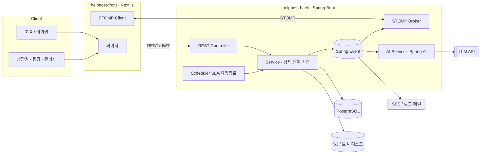
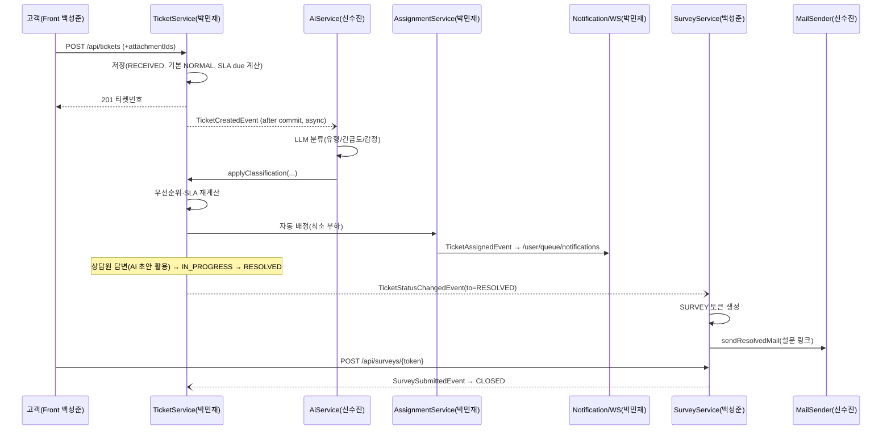

# 02. 아키텍처

## 1. 기술 스택 (백성준)

| 영역 | 기술 | 비고 |
|---|---|---|
| Front | Next.js 16.3.x 최신 안정 (App Router, TypeScript) | Sprint 0에 백성준이 `create-next-app@latest`로 생성 후 버전 고정 |
| UI | Tailwind CSS + shadcn/ui + lucide 아이콘 | 공용 컴포넌트·디자인 토큰은 백성준 ([08](08_design-system.md)) |
| 폼·조회 | react-hook-form + zod / TanStack Query | PRD Q18·Q19 확정 |
| 상태/통신 | fetch 래퍼(`lib/api/client.ts`, 기본 경로 상대 `/api`) + JWT 자동 재발급 (Access 메모리 / Refresh httpOnly 쿠키) | 백성준 |
| API 프록시 | `next.config.ts`의 `rewrites`: `/api/:path*` → `${BACKEND_ORIGIN}/api/:path*` (§2.1) | 백성준 |
| 실시간 | `@stomp/stompjs` | 박민재 |
| 차트 | Recharts 등 (신수진이 선택 후 백성준에게 의존성 CR) | 신수진 |
| Back | Spring Boot **4.1.1** / Java 21 / **Maven** | 백성준 초기 세팅 |
| 보안 | Spring Security + JWT(Access 30분 / Refresh 14일) | 백성준 |
| ORM | Spring Data JPA (+ 통계는 JPQL/Native Query) | 각 도메인 소유자 |
| 마이그레이션 | Flyway (PRD Q7 확정) | 각자 자기 테이블 |
| 실시간 | Spring WebSocket + STOMP (SimpleBroker) | 박민재 |
| AI | Spring AI **2.0.1** (`ChatClient`) — 제공자 설정으로 교체 | 신수진 |
| 스케줄 | `@Scheduled` (SLA 1분, 자동 종료 10분) | 박민재 |
| DB | PostgreSQL (로컬 docker / 배포 RDS) | |
| AWS | S3, SES, EC2, RDS | 신수진 (Sprint 4) |

> **확정 버전 (2026-09-29 기준)**
> | 항목 | 버전 | 비고 |
> |---|---|---|
> | Next.js | **최신 안정 16.3.x** (작성 시점 16.3.6) | S0에 `create-next-app@latest`로 설치 → 설치된 정확한 버전을 `package.json`에 고정(`^` 제거) |
> | Node.js | 20.9 이상 (팀·CI는 **22 LTS** 사용) | Next.js 16 최소 요구 20.9 |
> | Spring Boot | **4.1.1** | |
> | Spring AI | **2.0.1** (최신 GA) | Spring Boot 4.0/4.1 호환 라인. `spring-ai-bom` 2.0.1로 버전 관리 |
> | Java | 21 | |
> | PostgreSQL | 16 | 로컬 docker·CI·RDS 동일 메이저 |

---

## 2. 시스템 구성



### 2.1 요청 경로 (배포 환경)

> 프론트(`*.amplifyapp.com`)와 백엔드(`*.cloudfront.net`)는 서로 다른 사이트다. Refresh 쿠키가 서드파티 쿠키로 차단되지 않도록 REST는 프론트 도메인을 거쳐 보낸다 (PRD Q21).

| 요청 | 경로 | 인증 | 이유 |
|---|---|---|---|
| 일반 REST API | 브라우저 → Amplify(Next.js) `/api/*` → **rewrites** → CloudFront → EC2 | Access 토큰(헤더) + Refresh 쿠키(`/api/auth/*`) | 쿠키가 프론트 도메인 1st-party → Safari 등에서도 유지 |
| WebSocket(STOMP) | 브라우저 → CloudFront `wss://…/ws` **직접** → EC2 | STOMP `CONNECT` 헤더의 Access 토큰 | 쿠키 불필요. 백엔드는 `/ws`에 `FRONT_ORIGIN`만 허용 |
| 첨부 업로드 | 브라우저 → CloudFront `/api/attachments` **직접** | Access 토큰(회원) / 없음(비회원, 요청 제한 적용) | Amplify SSR의 크기 제한 회피(응답 5.72MB 제한은 문서 확인, 요청 제한은 미명시) → 백엔드 CORS는 이 경로만 `FRONT_ORIGIN` 허용 |
| 첨부 다운로드 | 브라우저 → S3 presigned URL **직접** | URL 서명 | 대용량 응답이 프록시를 거치지 않게 |
| 로컬 개발 | `localhost:3000/api/*` → rewrites → `localhost:8080` | 동일 | 배포와 같은 구조로 개발 |

- 백엔드는 프록시·CloudFront 뒤에 있으므로 `server.forward-headers-strategy: framework`로 `X-Forwarded-For`를 읽고, 요청 제한(RateLimitFilter)은 **실제 클라이언트 IP** 기준으로 센다.
- CSV 다운로드는 수 MB 미만이라 프록시 경유로 충분 (5.72MB를 넘을 정도로 커지면 직접 호출로 변경).

---

## 3. Frontend 구조 (helpnest-front)

```
src/
├─ app/
│  ├─ layout.tsx                       (백성준) 루트 레이아웃, Provider
│  ├─ (auth)/login, signup, forgot-password, reset-password  (백성준)
│  ├─ (main)/layout.tsx                (백성준) ★ 공용 Header + Sidebar + Footer
│  ├─ (main)/page.tsx                  (백성준) 홈(고객: FAQ/문의 진입, 직원: 콘솔로 리다이렉트)
│  ├─ (main)/inquiry/new, complete     (백성준) 문의 접수·접수 완료
│  ├─ (main)/inquiry/lookup, lookup/reset (백성준) 비회원 조회·조회 비밀번호 재설정
│  ├─ (main)/my/profile                (백성준) 내 정보·비밀번호 변경
│  ├─ (main)/my/inquiries, [id]        (백성준) 내 문의 (상세 타임라인은 박민재 컴포넌트 사용)
│  ├─ (main)/faq                       (백성준)
│  ├─ (main)/survey/[token]            (백성준)
│  ├─ (main)/chat                      (박민재) 고객 채팅
│  ├─ (main)/console/tickets, [id]     (박민재) 상담 콘솔
│  ├─ (main)/console/chat              (박민재) 상담원 채팅
│  ├─ (main)/console/dashboard         (신수진)
│  ├─ (main)/console/reports           (신수진)
│  ├─ (main)/console/customers/[key]   (백성준) 고객 이력
│  ├─ (main)/console/surveys           (백성준) 설문 결과
│  ├─ (main)/admin/members, faq, templates (백성준)
│  ├─ (main)/dev/ui                    (백성준) 공용 컴포넌트 사용 예시 (배포 전 접근 차단)
│  └─ (main)/admin/sla                 (박민재)
├─ components/
│  ├─ layout/  Header, Sidebar, Footer, NotificationBellSlot   (백성준)
│  ├─ ui/      shadcn/ui 원본 컴포넌트 (button, input, dialog, table, badge, toast ...)  (백성준)
│  ├─ common/  PageHeader, DataTable, EmptyState, ErrorState, LoadingSkeleton, ConfirmDialog, StatusBadge, PriorityBadge, SentimentBadge, PlainText  (백성준)
│  ├─ inquiry/, faq/, survey/, template/(TemplatePicker), customer/(CustomerHistoryPanel)  (백성준)
│  ├─ ticket/  TicketTable, TicketTimeline, ReplyEditor (박민재)
│  ├─ notification/ NotificationBell    (박민재)
│  ├─ chat/    ChatWindow               (박민재)
│  ├─ ai/      AiAnalysisPanel, AiDraftButton (신수진)
│  └─ dashboard/ KpiCard, DistributionBars(CSS 막대), AgentTable, CsvButton (신수진)
├─ lib/
│  ├─ api/client.ts                    (백성준) 공통 fetch + 토큰 재발급
│  ├─ api/{auth,faq,template,survey,attachment,customer}.ts (백성준)
│  ├─ api/{ticket,notification,chat}.ts (박민재)
│  ├─ api/{ai,dashboard,report}.ts     (신수진)
│  ├─ auth/                            (백성준) useAuth, AuthGuard(역할 가드) — Access 토큰 메모리 보관·새로고침 시 refresh 는 api/client.ts
│  └─ ws/stompClient.ts                (박민재)
├─ config/menu.ts                      (백성준) 역할별 사이드바 메뉴 정의
├─ config/badge.ts                     (백성준) 상태·우선순위·감정 → 배지 variant 매핑
├─ lib/format.ts                       (백성준) 날짜·시간·숫자 포맷 함수
├─ types/                              도메인별 소유 (auth.ts 백성준 / ticket.ts 박민재 / ai.ts 신수진)
└─ proxy.ts                            (백성준) 라우트 1차 확인 (Refresh 쿠키 유무, Next 16 에서 middleware.ts → proxy.ts) — 최종 권한 판단은 lib/auth의 AuthGuard
```

### 3.1 공용 레이아웃 규칙
- **Header**(백성준): 로고, 사용자 메뉴, 알림 벨 **슬롯**. 알림 벨 컴포넌트 자체는 박민재가 `components/notification/NotificationBell.tsx`로 만들고, 백성준이 Header에 1회 배치한다.
- **Sidebar**(백성준): `config/menu.ts`의 역할별 메뉴를 렌더링. 메뉴 추가는 백성준에게 CR.
- **Footer**(백성준): 고객 화면 하단 정보.
- 각 담당자는 `(main)/` 아래 **자기 페이지 폴더만** 만든다 → 레이아웃은 자동 적용.
- 다른 담당자 페이지에 들어가는 컴포넌트는 "컴포넌트 제공자가 만들고, 페이지 소유자가 import" 방식.
  - 티켓 상세(박민재) ← `AiAnalysisPanel`, `AiDraftButton`(신수진), `TemplatePicker`, `CustomerHistoryPanel`(백성준)

### 3.2 역할별 사이드바 메뉴 (초안)
| 역할 | 메뉴 |
|---|---|
| GUEST/CUSTOMER | 홈, FAQ, 문의하기, 내 문의(회원)/문의 조회(비회원), 1:1 채팅(회원), 내 정보(회원) |
| AGENT | 티켓함, 채팅 상담, 내 처리현황, 설문 결과(본인) |
| LEAD | + 전체 티켓, 대시보드, 월간 리포트, 설문 결과(전체), FAQ 관리, 템플릿 관리 |
| ADMIN | + 계정 관리, SLA 정책 |

---

## 4. Backend 구조 (helpnest-back)

```
com.helpnest
├─ HelpNestApplication.java                 (백성준)
├─ global/                                  (백성준) ★ 공용
│  ├─ config/  SecurityConfig, CorsConfig, JpaAuditingConfig, AsyncConfig, SchedulingConfig
│  ├─ security/ JwtProperties, JwtProvider(Access·Guest 토큰 발급, `guestTicketId(jwt)` 로 Guest 판정), RateLimitFilter (JWT 검증은 OAuth2 Resource Server 가 처리 — 별도 JwtAuthFilter·UserDetails 없음, 컨트롤러는 `@AuthenticationPrincipal Jwt` → `JwtProvider.memberId(jwt)`)
│  ├─ common/  ApiResponse<T>, PageResponse<T>, BaseTimeEntity
│  ├─ error/   ErrorCode(interface), CommonErrorCode, BusinessException, GlobalExceptionHandler
│  └─ websocket/ WebSocketConfig, StompAuthInterceptor      (박민재) ← global 안이지만 박민재 소유
├─ domain/
│  ├─ auth/, member/, attachment/, faq/, template/, survey/, customer/   (백성준)
│  ├─ ticket/, assignment/, sla/, notification/, chat/                  (박민재)
│  └─ ai/, dashboard/, report/                                          (신수진)
└─ infra/                                   (신수진)
   ├─ storage/ FileStorage(interface), LocalFileStorage(!prod), S3FileStorage(prod)
   ├─ mail/    MailSender(interface) → DefaultMailSender(MailTemplates·MAIL_LOG) → MailTransport: LogMailTransport(!prod), SesMailTransport(prod)
   ├─ llm/     LlmClient(interface), MockLlmClient(mock), SpringAiLlmClient
   └─ aws/     AwsConfig(prod) — S3Client·S3Presigner·SesV2Client, 자격 증명은 SDK 기본 체인(EC2 IAM Role)
```
- 도메인 내부 구조: `controller / service / repository / entity / dto / event / port`
- **인증 예외 경로(permitAll)** 는 `SecurityConfig`(백성준)에서 [04 API 명세](04_api-spec.md)의 권한 열이 "공개"인 엔드포인트 + `/ws/**`(STOMP 인증은 `StompAuthInterceptor`가 담당) + `/actuator/health` 기준으로 관리한다. 새 공개 API가 생기면 API 명세 PR과 함께 백성준에게 CR.
- 프로필: `local`(docker DB, 로컬 저장, 로그 메일) / `prod`(RDS, S3, SES)

---

## 5. 도메인 간 연동 계약 (이벤트 · 포트)

> 남의 코드를 수정하지 않고 연동하기 위한 **유일한 통로**. 인터페이스는 **제공자(구현자) 패키지**에 두고, Sprint 0에 **스텁 구현**을 먼저 머지한다.
>
> **읽기 전용 예외:** 통계·목록 조회(대시보드·리포트(신수진), 고객 이력·설문 결과(백성준), SLA·배정(박민재)의 MEMBER 조회 등)는 **자기 패키지 안의 읽기 전용 Native Query/JPQL**로 다른 테이블을 JOIN해도 된다. 단 **쓰기(INSERT/UPDATE/DELETE)는 반드시 포트**, 남의 Entity·Repository 클래스는 import하지 않으며, 참조하는 컬럼 목록을 PR 본문에 적어 소유자가 스키마 변경 시 알 수 있게 한다.

### 5.1 이벤트 (발행자 소유 클래스)
| 이벤트 | 발행(소유) | 구독 | 처리 |
|---|---|---|---|
| `TicketCreatedEvent(ticketId)` | 박민재 | 신수진 `AiClassifyListener` | `@TransactionalEventListener(AFTER_COMMIT)` + `@Async` 로 LLM 분류 |
| `TicketAssignedEvent(ticketId, agentId)` | 박민재 | 박민재 `NotificationListener` | 상담원 알림 |
| `TicketStatusChangedEvent(ticketId, from, to, actorId)` | 박민재 | 백성준 `SurveyListener`, 박민재 알림 | to=RESOLVED → 설문 생성(재해결이면 재발급) → 메일 발송 / RESOLVED→IN_PROGRESS(재문의) → 미제출 설문 만료 |
| `ReplyCreatedEvent(ticketId, replyId, writerType, isInternal)` | 박민재 | 박민재 알림 | 고객 답글 → 상담원 알림 / 상담원 공개 답변 → 고객 웹 알림(회원) + `MailSender.sendAgentReplyMail`(신수진) |
| `SurveySubmittedEvent(ticketId, rating)` | 백성준 | 박민재 `TicketCloseListener` | 티켓 CLOSED |

### 5.2 포트 (인터페이스 소유 = 구현자)
| 포트 | 소유/구현 | 호출자 | 시그니처 |
|---|---|---|---|
| `TicketClassificationPort` | 박민재 | 신수진 | `applyClassification(ticketId, category, priority, sentiment)` / `applyClassificationFailed(ticketId)` → 우선순위·SLA 재계산 후 자동 배정 |
| `TicketQueryPort` | 박민재 | 백성준, 신수진 | `getTicketSummary(ticketId)`, `findResolvedReplies(category, limit)` (AI 초안 컨텍스트) |
| `AttachmentPort` | 백성준 | 박민재 | `linkToTicket(List<attachmentId>, ticketId, replyId)` |
| `FaqQueryPort` | 백성준 | 신수진 | `findPublishedByCategory(category, keyword, limit)` |
| `MailSender` | 신수진 | 백성준, 박민재 | `sendResolvedMail(ResolvedMailCommand)` (고객명, 이메일, 티켓번호, 답변 요약, 설문 링크) / `sendAgentReplyMail(AgentReplyMailCommand)`(박민재) / `sendPasswordResetMail(PasswordResetMailCommand)`(백성준, 회원·비회원 공용) |
| `FileStorage` | 신수진 | 백성준 | `upload(MultipartFile, keyPrefix)` → key(`keyPrefix/UUID.ext`), `getDownloadUrl(key)`(prod presigned GET 10분 / local `null`), `load(key)`(local 스트림 전용), `delete(key)` |
| `AiResultPort` | 신수진 | 박민재 | `markOverridden(ticketId, memberId, category, priority)` (상담원 수동 분류 수정 기록) |
| `NotificationPort` | 박민재 | 백성준, 신수진 | `notify(receiverId, type, ticketId, message)` |
| `TicketGuestPort` | 박민재 | 백성준 | `verifyGuest(ticketNo, email)` → ticketId, `findGuestPasswordHash(ticketId)` → BCrypt 해시, `updateGuestPassword(ticketId, passwordHash)` (비회원 로그인·조회 비밀번호 재설정). 세 메서드 모두 없으면 예외가 아니라 null — 존재 여부가 응답으로 드러나면 계정 열거가 된다. BCrypt 비교·해싱은 호출자(백성준) 책임이라 원문 비밀번호는 경계를 넘지 않는다 |
| `MemberQueryPort` | 백성준 | 박민재, 신수진 | `findAssignableAgents()`, `getMember(id)`, `touchLastAssigned(agentId)` |

### 5.3 핵심 시퀀스 — 접수부터 종료까지


---

## 6. WebSocket (박민재)
| 항목 | 값 |
|---|---|
| 엔드포인트 | `/ws` (SockJS 미사용, 순수 WebSocket) |
| 앱 prefix | `/app` |
| 브로커 | `/topic`, `/queue` (SimpleBroker) |
| 인증 | STOMP `CONNECT` 헤더 `Authorization: Bearer {accessToken}` → `StompAuthInterceptor` |
| 개인 알림 | `/user/queue/notifications` |
| 채팅 대기 상태 | `/user/queue/chat-status` (대기 순번·연결·시간 초과) |
| 대기열 처리 | 10초 주기 스케줄러 + 상담원 available ON/티켓 종료 시 즉시 재시도, FIFO |
| 콘솔 공지 | `/topic/console/tickets` (신규/상태 변경 → 목록 갱신) |
| 채팅 수신 | `/topic/chat/{roomId}` |
| 채팅 송신 | `/app/chat/{roomId}/send` |

---

## 7. 로컬 환경 (백성준)
`docker-compose.yml`
```yaml
services:
  postgres:
    image: postgres:16
    container_name: helpnest-db
    environment:
      POSTGRES_DB: helpnest
      POSTGRES_USER: helpnest
      POSTGRES_PASSWORD: helpnest
      TZ: Asia/Seoul
    ports: ["5432:5432"]
    volumes: [helpnest-data:/var/lib/postgresql/data]
volumes:
  helpnest-data:
```
환경 변수 (`.env.example`만 커밋)
| 키 | 사용 | 소유 |
|---|---|---|
| `JWT_SECRET` | 토큰 서명 | 백성준 |
| `DB_URL`, `DB_USERNAME`, `DB_PASSWORD` | DB | 백성준 |
| `LLM_PROVIDER`, `LLM_API_KEY`, `LLM_MODEL` | AI | 신수진 |
| `AWS_REGION`, `S3_BUCKET`, `SES_FROM_EMAIL` | AWS (prod) | 신수진 |
| `FRONT_ORIGIN` | CORS, 설문 링크 | 백성준 |
| `REFRESH_COOKIE_SECURE` | Refresh 쿠키 Secure 여부 (로컬 `false` / 배포 `true`). SameSite는 항상 `Lax`, Path `/`, Domain 미지정 — REST가 프록시로 같은 출처가 되므로 가능 | 백성준 |
| `BACKEND_ORIGIN` | Front **서버 전용**(rewrites 대상). 로컬 `http://localhost:8080` / 배포 `https://xxxx.cloudfront.net` | 백성준 |
| `NEXT_PUBLIC_UPLOAD_BASE_URL` | Front — 첨부 업로드 직접 호출 주소 (로컬 `http://localhost:8080` / 배포 CloudFront) | 백성준 |
| `NEXT_PUBLIC_WS_URL` | Front — `ws://localhost:8080/ws` / 배포 `wss://xxxx.cloudfront.net/ws` | 백성준 |

---

## 8. AWS 배포 (신수진, Sprint 4)
| 자원 | 용도 | 체크 |
|---|---|---|
| RDS PostgreSQL | 운영 DB | 로컬 Flyway 스크립트로 스키마 생성 |
| S3 | 첨부 (Private + Presigned URL) | 버킷 정책(퍼블릭 차단), **CORS**: 프론트가 presigned URL 을 `fetch` 로 받으므로 Amplify 도메인 `GET` 허용. 버킷 이름은 `helpnest-` 로 시작 |
| SES | 결과/설문 메일 | 도메인 `helpnest.kro.kr` 인증(Easy DKIM), **프로덕션 액세스 승인됨**(샌드박스 해제, 10/6 확인). 발신 `SES_FROM_EMAIL=no-reply@helpnest.kro.kr` |
| IAM | EC2 인스턴스 Role | `s3:PutObject/GetObject/DeleteObject`(운영 버킷 한정), `ses:SendEmail`. 앱은 키 없이 SDK 기본 체인으로 Role 사용 |
| 연결 확인 | 배포 전후 | `AWS_LIVE=true AWS_PROFILE=<프로필> SES_FROM_EMAIL=… SES_TEST_TO=… ./mvnw test -Dtest=AwsLiveTest` — 임시 버킷 왕복(생성·업로드·presigned GET·삭제) + SES 1통. 10/6 로컬 2/2 통과 |
| EC2 | Spring Boot 백엔드 (8080) | **CloudFront 뒤에 배치**(PRD Q20). 보안그룹은 CloudFront 관리형 prefix list(`com.amazonaws.global.cloudfront.origin-facing`)만 8080 허용 |
| **CloudFront** | 백엔드 HTTPS·WSS 제공 (도메인 없이 `*.cloudfront.net` 인증서 사용) | Origin: EC2 **퍼블릭 DNS**(IP 불가), Origin protocol HTTP 8080 / Viewer protocol **HTTPS only**. Behavior `/api/*`: 캐시 정책 **CachingDisabled**, 오리진 요청 정책 **AllViewerExceptHostHeader**, 허용 메서드 GET~DELETE 전체. Behavior `/ws*`: CachingDisabled + WebSocket 헤더 전달(`Sec-WebSocket-Key/Version/Protocol/Extensions`, AllViewer 정책이면 자동) / 프론트 환경변수는 §7 참고 |
| **Amplify Hosting** | Next.js 프론트 (PRD Q9) | GitHub `helpnest-front`의 `main` 연결 → main 머지 시 자동 배포. **GitHub 연동 승인은 repo 소유자 백성준 계정으로** 진행. 환경변수 `BACKEND_ORIGIN`(CloudFront https), `NEXT_PUBLIC_UPLOAD_BASE_URL`, `NEXT_PUBLIC_WS_URL`(wss) 등록. 백엔드 `FRONT_ORIGIN`(CORS·메일 링크)에 Amplify 도메인 설정 |
| 비밀값 | 환경변수 / Parameter Store | 키 커밋 금지 |
