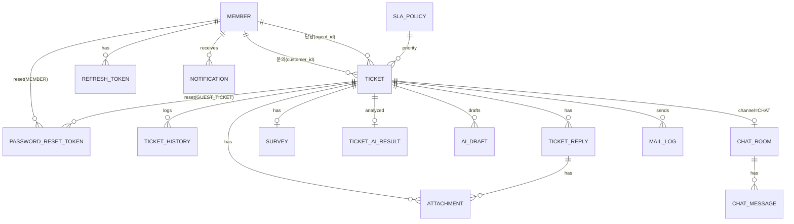

# 03. 데이터베이스 (PostgreSQL)

> 테이블 소유자만 해당 테이블의 엔티티·마이그레이션을 작성/수정한다. 다른 사람은 **포트** 또는 **자기 패키지의 읽기 전용 쿼리**로만 조회한다 ([02 §5 읽기 전용 예외](02_architecture.md#5-도메인-간-연동-계약-이벤트--포트)).

## 1. ERD



## 2. 테이블 목록 · 소유자

| 테이블 | 소유 | 구분 | 설명 |
|---|:-:|---|---|
| MEMBER | 백성준 | 핵심 | 회원/상담원/팀장/관리자 |
| REFRESH_TOKEN | 백성준 | 보조 | JWT Refresh 저장·폐기 |
| PASSWORD_RESET_TOKEN | 백성준 | 보조 | 회원 비밀번호·비회원 조회 비밀번호 재설정 링크 토큰 |
| ATTACHMENT | 백성준 | 핵심 | 첨부 메타데이터 (파일 본체는 S3/로컬) |
| FAQ | 백성준 | 핵심 | 고객용 FAQ, AI 초안 참고 자료 |
| TEMPLATE | 백성준 | 핵심 | 상담원 답변 템플릿 |
| SURVEY | 백성준 | 핵심 | 만족도 설문 |
| TICKET | 박민재 | 핵심 | 문의 티켓 |
| TICKET_HISTORY | 박민재 | 핵심 | 상태/배정/우선순위 변경 이력 |
| TICKET_REPLY | 박민재 | 핵심 | 고객·상담원 답변, 내부 메모 |
| SLA_POLICY | 박민재 | 보조 | 우선순위별 응답 기한 |
| NOTIFICATION | 박민재 | 보조 | 알림 저장 |
| CHAT_ROOM / CHAT_MESSAGE | 박민재 | 보조 | 1:1 채팅 (대기열 포함) |
| TICKET_AI_RESULT | 신수진 | 보조 | LLM 분류 결과 |
| AI_DRAFT | 신수진 | 보조 | LLM 답변 초안 |
| MAIL_LOG | 신수진 | 보조 | 메일 발송 기록/재시도 |

### 2.1 코드 값 (enum, VARCHAR 저장)
| 코드 | 값 |
|---|---|
| role | `CUSTOMER`, `AGENT`, `LEAD`, `ADMIN` |
| ticket.status | `RECEIVED`, `ASSIGNED`, `IN_PROGRESS`, `RESOLVED`, `CLOSED` |
| priority | `URGENT`, `HIGH`, `NORMAL`, `LOW` |
| category (PRD Q4) | `DELIVERY`, `REFUND`, `EXCHANGE`, `PAYMENT`, `ACCOUNT`, `SERVICE_ERROR`, `ETC` |
| sentiment | `NEGATIVE`, `NEUTRAL`, `POSITIVE` |
| channel | `WEB`, `CHAT` |
| writer_type | `CUSTOMER`, `GUEST`, `AGENT`, `SYSTEM` |
| history.action | `CREATE`, `STATUS_CHANGE`, `ASSIGN`, `REASSIGN`, `PRIORITY_CHANGE`, `CATEGORY_CHANGE` |
| notification.type | `ASSIGNED`, `SLA_WARNING`, `SLA_BREACHED`, `CUSTOMER_REPLY`, `AGENT_REPLY`(고객 수신), `STATUS_CHANGED`, `UNASSIGNED`, `CHAT_REQUEST` |
| chat_room.status | `WAITING`, `OPEN`, `CLOSED`, `CONVERTED`(티켓 전환), `CANCELED`(대기 중 이탈) |
| mail_log.mail_type | `RESOLVED_SURVEY`, `AGENT_REPLY`, `PASSWORD_RESET`, `GUEST_PASSWORD_RESET` |
| reset.target_type | `MEMBER`, `GUEST_TICKET` |

## 3. DDL

> Flyway(PRD Q7 확정)로 아래를 소유자별 파일로 나눈다. **생성 순서(FK 의존):** ① 백성준 `MEMBER, REFRESH_TOKEN` (`PASSWORD_RESET_TOKEN`은 FK가 없어 S2에 추가해도 됨) → ② 박민재 `SLA_POLICY, TICKET, TICKET_HISTORY, TICKET_REPLY` → ③ 백성준 `ATTACHMENT, FAQ, TEMPLATE, SURVEY` → ④ 박민재 `NOTIFICATION, CHAT_*` → ⑤ 신수진 `TICKET_AI_RESULT, AI_DRAFT, MAIL_LOG`. Sprint 0에 이 순서대로 타임스탬프를 잡는다.

### 3.1 백성준
```sql
-- @owner BSJ
CREATE TABLE member (
  member_id      BIGSERIAL PRIMARY KEY,
  email          VARCHAR(100) NOT NULL UNIQUE,
  password       VARCHAR(100) NOT NULL,              -- BCrypt
  name           VARCHAR(50)  NOT NULL,
  phone          VARCHAR(20),
  role           VARCHAR(20)  NOT NULL CHECK (role IN ('CUSTOMER','AGENT','LEAD','ADMIN')),
  status         VARCHAR(20)  NOT NULL DEFAULT 'ACTIVE' CHECK (status IN ('ACTIVE','INACTIVE')),
  available      BOOLEAN      NOT NULL DEFAULT FALSE, -- 상담원 자동배정 대상 여부
  last_assigned_at TIMESTAMPTZ,                       -- 최소부하 동률 처리 (배정 시 박민재 코드가 MemberQueryPort로 갱신)
  created_at     TIMESTAMPTZ  NOT NULL DEFAULT NOW(),
  updated_at     TIMESTAMPTZ  NOT NULL DEFAULT NOW()
);

CREATE TABLE refresh_token (
  token_id    BIGSERIAL PRIMARY KEY,
  member_id   BIGINT NOT NULL REFERENCES member(member_id),
  token_hash  VARCHAR(200) NOT NULL UNIQUE,
  expires_at  TIMESTAMPTZ NOT NULL,
  revoked     BOOLEAN NOT NULL DEFAULT FALSE,
  created_at  TIMESTAMPTZ NOT NULL DEFAULT NOW()
);

CREATE TABLE password_reset_token (
  reset_id     BIGSERIAL PRIMARY KEY,
  target_type  VARCHAR(20) NOT NULL CHECK (target_type IN ('MEMBER','GUEST_TICKET')),
  target_id    BIGINT NOT NULL,                  -- member_id 또는 ticket_id (FK 없이 참조)
  token_hash   VARCHAR(200) NOT NULL UNIQUE,     -- 원문 토큰은 메일 링크에만, DB엔 SHA-256 해시
  expires_at   TIMESTAMPTZ NOT NULL,             -- 발급 + 30분
  used_at      TIMESTAMPTZ,
  created_at   TIMESTAMPTZ NOT NULL DEFAULT NOW()
);
```
> `last_assigned_at`은 MEMBER(백성준 소유)이지만 배정(박민재) 시 갱신이 필요 → `MemberQueryPort.touchLastAssigned(agentId)`를 백성준이 제공.

```sql
-- @owner BSJ  (TICKET 생성 이후)
CREATE TABLE attachment (
  attachment_id  BIGINT PRIMARY KEY,                         -- 앱이 만드는 추측 불가 난수 [2^52, 2^53) (비회원 첨부 가로채기 방지)
  ticket_id      BIGINT REFERENCES ticket(ticket_id),        -- 업로드 직후엔 NULL, 티켓 생성 시 연결
  reply_id       BIGINT REFERENCES ticket_reply(reply_id),
  original_name  VARCHAR(255) NOT NULL,
  stored_key     VARCHAR(500) NOT NULL,                      -- S3 key / 로컬 경로
  content_type   VARCHAR(100) NOT NULL,
  size_bytes     BIGINT NOT NULL CHECK (size_bytes <= 10485760),
  uploaded_by    BIGINT REFERENCES member(member_id),        -- 비회원 NULL
  created_at     TIMESTAMPTZ NOT NULL DEFAULT NOW()
);
CREATE INDEX idx_attachment_orphan ON attachment(created_at) WHERE ticket_id IS NULL;   -- 고아 첨부 정리

CREATE TABLE faq (
  faq_id        BIGSERIAL PRIMARY KEY,
  category      VARCHAR(30) NOT NULL,
  question      VARCHAR(300) NOT NULL,
  answer        TEXT NOT NULL,
  is_published  BOOLEAN NOT NULL DEFAULT TRUE,
  view_count    INT NOT NULL DEFAULT 0,
  created_by    BIGINT NOT NULL REFERENCES member(member_id),
  created_at    TIMESTAMPTZ NOT NULL DEFAULT NOW(),
  updated_at    TIMESTAMPTZ NOT NULL DEFAULT NOW()
);

CREATE TABLE template (
  template_id   BIGSERIAL PRIMARY KEY,
  category      VARCHAR(30) NOT NULL,
  title         VARCHAR(100) NOT NULL,
  content       TEXT NOT NULL,                  -- {고객명}, {티켓번호} 치환
  is_active     BOOLEAN NOT NULL DEFAULT TRUE,
  created_by    BIGINT NOT NULL REFERENCES member(member_id),
  created_at    TIMESTAMPTZ NOT NULL DEFAULT NOW(),
  updated_at    TIMESTAMPTZ NOT NULL DEFAULT NOW()
);

CREATE TABLE survey (
  survey_id     BIGSERIAL PRIMARY KEY,
  ticket_id     BIGINT NOT NULL UNIQUE REFERENCES ticket(ticket_id),
  token         VARCHAR(64) NOT NULL UNIQUE,
  rating        SMALLINT CHECK (rating BETWEEN 1 AND 5),
  comment       VARCHAR(1000),
  sent_at       TIMESTAMPTZ NOT NULL DEFAULT NOW(),
  expires_at    TIMESTAMPTZ NOT NULL,           -- sent_at + 72h (재문의 시 NOW()로 만료)
  submitted_at  TIMESTAMPTZ
);
-- 재해결 시 같은 행을 재발급: token·sent_at·expires_at 갱신 (ticket_id UNIQUE 유지, FR-SRV-06)
```

### 3.2 박민재
```sql
-- @owner PMJ
CREATE TABLE sla_policy (
  priority          VARCHAR(10) PRIMARY KEY,
  response_minutes  INT NOT NULL,
  warning_ratio     NUMERIC(3,2) NOT NULL DEFAULT 0.80,
  updated_at        TIMESTAMPTZ NOT NULL DEFAULT NOW()
);
INSERT INTO sla_policy(priority, response_minutes) VALUES
 ('URGENT',60),('HIGH',240),('NORMAL',1440),('LOW',2880);

CREATE SEQUENCE ticket_no_seq START 1;   -- 티켓번호 일련번호 (FR-INQ-03)

CREATE TABLE ticket (
  ticket_id             BIGSERIAL PRIMARY KEY,
  ticket_no             VARCHAR(20) NOT NULL UNIQUE,      -- HN-20261002-000123
                                                          -- 'HN-' || to_char(NOW() AT TIME ZONE 'Asia/Seoul','YYYYMMDD') || '-' || lpad(nextval('ticket_no_seq')::text, 6, '0')
  customer_id           BIGINT REFERENCES member(member_id),
  guest_name            VARCHAR(50),
  guest_email           VARCHAR(100),
  guest_password_hash   VARCHAR(100),
  title                 VARCHAR(200) NOT NULL,
  content               TEXT NOT NULL,
  channel               VARCHAR(10) NOT NULL DEFAULT 'WEB',
  category              VARCHAR(30) NOT NULL DEFAULT 'ETC',
  priority              VARCHAR(10) NOT NULL DEFAULT 'NORMAL' REFERENCES sla_policy(priority),
  sentiment             VARCHAR(10),
  status                VARCHAR(20) NOT NULL DEFAULT 'RECEIVED',
  agent_id              BIGINT REFERENCES member(member_id),
  first_response_due_at TIMESTAMPTZ NOT NULL,
  first_responded_at    TIMESTAMPTZ,
  sla_warned            BOOLEAN NOT NULL DEFAULT FALSE,
  sla_breached          BOOLEAN NOT NULL DEFAULT FALSE,
  assigned_at           TIMESTAMPTZ,
  resolved_at           TIMESTAMPTZ,
  closed_at             TIMESTAMPTZ,
  created_at            TIMESTAMPTZ NOT NULL DEFAULT NOW(),
  updated_at            TIMESTAMPTZ NOT NULL DEFAULT NOW(),
  CONSTRAINT chk_ticket_customer CHECK (customer_id IS NOT NULL OR guest_email IS NOT NULL)
);
CREATE INDEX idx_ticket_status_agent ON ticket(status, agent_id);
CREATE INDEX idx_ticket_sla ON ticket(first_response_due_at) WHERE first_responded_at IS NULL;
CREATE INDEX idx_ticket_customer ON ticket(customer_id);
CREATE INDEX idx_ticket_guest_email ON ticket(lower(guest_email));

CREATE TABLE ticket_history (
  history_id   BIGSERIAL PRIMARY KEY,
  ticket_id    BIGINT NOT NULL REFERENCES ticket(ticket_id),
  action       VARCHAR(30) NOT NULL,
  from_value   VARCHAR(50),
  to_value     VARCHAR(50),
  actor_id     BIGINT REFERENCES member(member_id),   -- SYSTEM/비회원이면 NULL
  actor_type   VARCHAR(10) NOT NULL,                  -- MEMBER / SYSTEM / GUEST
  memo         VARCHAR(500),
  created_at   TIMESTAMPTZ NOT NULL DEFAULT NOW()
);

CREATE TABLE ticket_reply (
  reply_id      BIGSERIAL PRIMARY KEY,
  ticket_id     BIGINT NOT NULL REFERENCES ticket(ticket_id),
  writer_id     BIGINT REFERENCES member(member_id),
  writer_type   VARCHAR(10) NOT NULL,
  content       TEXT NOT NULL,
  is_internal   BOOLEAN NOT NULL DEFAULT FALSE,       -- 내부 메모
  ai_draft_id   BIGINT,                               -- 사용한 AI 초안 (FK 없이 참조, 신수진 테이블)
  created_at    TIMESTAMPTZ NOT NULL DEFAULT NOW()
);

CREATE TABLE notification (
  notification_id BIGSERIAL PRIMARY KEY,
  receiver_id     BIGINT NOT NULL REFERENCES member(member_id),
  type            VARCHAR(30) NOT NULL,
  ticket_id       BIGINT REFERENCES ticket(ticket_id),
  message         VARCHAR(300) NOT NULL,
  is_read         BOOLEAN NOT NULL DEFAULT FALSE,
  created_at      TIMESTAMPTZ NOT NULL DEFAULT NOW()
);
CREATE INDEX idx_noti_receiver ON notification(receiver_id, is_read);

CREATE TABLE chat_room (
  room_id      BIGSERIAL PRIMARY KEY,
  ticket_id    BIGINT UNIQUE REFERENCES ticket(ticket_id),   -- WAITING/CANCELED 동안 NULL
  customer_id  BIGINT NOT NULL REFERENCES member(member_id),
  agent_id     BIGINT REFERENCES member(member_id),
  status       VARCHAR(10) NOT NULL DEFAULT 'WAITING',
  queued_at    TIMESTAMPTZ NOT NULL DEFAULT NOW(),            -- 대기 순번 = queued_at 순
  opened_at    TIMESTAMPTZ,
  created_at   TIMESTAMPTZ NOT NULL DEFAULT NOW(),
  closed_at    TIMESTAMPTZ
);
CREATE INDEX idx_chat_room_waiting ON chat_room(queued_at) WHERE status = 'WAITING';

CREATE TABLE chat_message (
  message_id  BIGSERIAL PRIMARY KEY,
  room_id     BIGINT NOT NULL REFERENCES chat_room(room_id),
  sender_id   BIGINT NOT NULL REFERENCES member(member_id),
  content     TEXT NOT NULL,
  created_at  TIMESTAMPTZ NOT NULL DEFAULT NOW()
);
CREATE INDEX idx_chat_msg_room ON chat_message(room_id, created_at);
```

### 3.3 신수진
```sql
-- @owner SSJ
CREATE TABLE ticket_ai_result (
  ai_result_id  BIGSERIAL PRIMARY KEY,
  ticket_id     BIGINT NOT NULL UNIQUE REFERENCES ticket(ticket_id),
  category      VARCHAR(30),
  urgency       VARCHAR(10),
  sentiment     VARCHAR(10),
  summary       VARCHAR(500),
  confidence    NUMERIC(3,2),
  status        VARCHAR(10) NOT NULL,          -- SUCCESS / FAILED
  model         VARCHAR(100),
  raw_response  JSONB,
  latency_ms    INT,
  overridden_by BIGINT REFERENCES member(member_id), -- 상담원 수동 수정
  created_at    TIMESTAMPTZ NOT NULL DEFAULT NOW(),
  updated_at    TIMESTAMPTZ NOT NULL DEFAULT NOW()
);

CREATE TABLE ai_draft (
  draft_id       BIGSERIAL PRIMARY KEY,
  ticket_id      BIGINT NOT NULL REFERENCES ticket(ticket_id),
  requested_by   BIGINT NOT NULL REFERENCES member(member_id),
  content        TEXT NOT NULL,
  reference_refs JSONB,                        -- [{"type":"FAQ","id":3},{"type":"REPLY","id":41}]
  model          VARCHAR(100),
  created_at     TIMESTAMPTZ NOT NULL DEFAULT NOW()
);

CREATE TABLE mail_log (
  mail_id     BIGSERIAL PRIMARY KEY,
  ticket_id   BIGINT REFERENCES ticket(ticket_id),
  to_email    VARCHAR(100) NOT NULL,
  mail_type   VARCHAR(30) NOT NULL,            -- RESOLVED_SURVEY / AGENT_REPLY / PASSWORD_RESET / GUEST_PASSWORD_RESET
  status      VARCHAR(10) NOT NULL,            -- SENT / FAILED / LOGGED(local)
  retry_count INT NOT NULL DEFAULT 0,
  error_msg   VARCHAR(500),
  created_at  TIMESTAMPTZ NOT NULL DEFAULT NOW(),
  sent_at     TIMESTAMPTZ
);
```

## 4. PostgreSQL 시간 계산 쿼리 (기획서의 Oracle 시간 함수 대체)

### 4.1 SLA 기한 계산 (박민재)
```sql
-- 티켓 생성/우선순위 변경 시
UPDATE ticket t
SET first_response_due_at = t.created_at + (p.response_minutes * INTERVAL '1 minute')
FROM sla_policy p
WHERE p.priority = t.priority AND t.ticket_id = :ticketId;
```

### 4.2 SLA 임박/초과 대상 (박민재, 1분 스케줄러)
```sql
-- 임박(80% 경과, 아직 미응답·미알림)
SELECT t.ticket_id, t.agent_id
FROM ticket t JOIN sla_policy p ON p.priority = t.priority
WHERE t.first_responded_at IS NULL
  AND t.status NOT IN ('RESOLVED','CLOSED')
  AND t.sla_warned = FALSE
  AND NOW() >= t.created_at + (p.response_minutes * p.warning_ratio) * INTERVAL '1 minute';

-- 초과
SELECT ticket_id, agent_id FROM ticket
WHERE first_responded_at IS NULL
  AND status NOT IN ('RESOLVED','CLOSED')
  AND sla_breached = FALSE
  AND NOW() > first_response_due_at;
```

### 4.3 남은 시간 (콘솔 목록 표시, 박민재)
```sql
SELECT ticket_id,
       EXTRACT(EPOCH FROM (first_response_due_at - NOW())) / 60 AS remain_minutes
FROM ticket WHERE first_responded_at IS NULL;
```

### 4.4 상담원별 평균 처리시간 (신수진, 대시보드)
```sql
SELECT t.agent_id, m.name,
       COUNT(*) FILTER (WHERE t.status IN ('ASSIGNED','IN_PROGRESS'))                        AS open_cnt,
       COUNT(*) FILTER (WHERE t.resolved_at >= date_trunc('day', NOW()))                     AS resolved_today,
       ROUND(AVG(EXTRACT(EPOCH FROM (t.first_responded_at - t.created_at)) / 60)::numeric, 1) AS avg_first_response_min,
       ROUND(AVG(EXTRACT(EPOCH FROM (t.resolved_at - t.created_at)) / 3600)::numeric, 2)      AS avg_resolve_hour,
       ROUND(100.0 * COUNT(*) FILTER (WHERE t.sla_breached) / NULLIF(COUNT(*),0), 1)          AS sla_breach_rate,
       ROUND(AVG(s.rating)::numeric, 2)                                                       AS avg_rating
FROM ticket t
JOIN member m ON m.member_id = t.agent_id
LEFT JOIN survey s ON s.ticket_id = t.ticket_id
WHERE t.created_at >= NOW() - (:days * INTERVAL '1 day')
GROUP BY t.agent_id, m.name;
```

### 4.5 월간 유형별 리포트 (신수진)
```sql
SELECT category,
       COUNT(*) AS cnt,
       ROUND(AVG(EXTRACT(EPOCH FROM (resolved_at - created_at)) / 3600)::numeric, 2) AS avg_resolve_hour,
       ROUND(100.0 * COUNT(*) FILTER (WHERE sentiment = 'NEGATIVE') / COUNT(*), 1)  AS negative_rate
FROM ticket
WHERE created_at >= date_trunc('month', :month::date)
  AND created_at <  date_trunc('month', :month::date) + INTERVAL '1 month'
GROUP BY category ORDER BY cnt DESC;
```

### 4.6 최소 부하 상담원 (박민재)
```sql
SELECT m.member_id
FROM member m
LEFT JOIN ticket t ON t.agent_id = m.member_id AND t.status IN ('ASSIGNED','IN_PROGRESS')
WHERE m.role = 'AGENT' AND m.status = 'ACTIVE' AND m.available = TRUE
GROUP BY m.member_id, m.last_assigned_at
ORDER BY COUNT(t.ticket_id) ASC, m.last_assigned_at ASC NULLS FIRST
LIMIT 1;
```

### 4.7 채팅 대기 순번 (박민재)
```sql
SELECT COUNT(*) + 1 AS position FROM chat_room
WHERE status = 'WAITING' AND queued_at < (SELECT queued_at FROM chat_room WHERE room_id = :roomId);
```

### 4.8 설문 결과 요약 (백성준)
```sql
SELECT COUNT(*) FILTER (WHERE submitted_at IS NOT NULL)                    AS responded,
       COUNT(*)                                                           AS sent,
       ROUND(100.0 * COUNT(*) FILTER (WHERE submitted_at IS NOT NULL) / NULLIF(COUNT(*),0), 1) AS response_rate,
       ROUND(AVG(rating)::numeric, 2)                                     AS avg_rating,
       COUNT(*) FILTER (WHERE rating = 5) AS r5, COUNT(*) FILTER (WHERE rating = 4) AS r4,
       COUNT(*) FILTER (WHERE rating = 3) AS r3, COUNT(*) FILTER (WHERE rating = 2) AS r2,
       COUNT(*) FILTER (WHERE rating = 1) AS r1
FROM survey
WHERE sent_at >= :from AND sent_at < :to;
```

### 4.9 자동 종료 대상 (박민재, 10분 스케줄러)
```sql
SELECT ticket_id FROM ticket
WHERE status = 'RESOLVED' AND resolved_at < NOW() - INTERVAL '72 hours';
```

## 5. 시드 데이터 (각자 소유 파일)
- 위치: `src/main/resources/db/seed/` — **local 프로필에서만** Flyway가 읽는다(`application-local.yml`의 `flyway.locations`). 운영에는 들어가지 않고, CI는 local 프로필로 돌아 시드까지 적용된다.
- 이름: Flyway **반복 마이그레이션** `R__seed_{이니셜}_{내용}.sql` (내용이 바뀌면 다시 실행) → `INSERT ... ON CONFLICT DO NOTHING` 처럼 여러 번 실행해도 안전하게 쓴다.

| 파일 | 소유 | 내용 |
|---|---|---|
| `R__seed_BSJ_member.sql` | 백성준 | ADMIN 1, LEAD 1, AGENT 3, CUSTOMER 3 — `admin@helpnest.local`, `lead@…`, `agent1~3@…`, `customer1~3@…` (비밀번호 공통 `Test1234!`) ✅ |
| `R__seed_BSJ_faq_template.sql` | 백성준 | 유형별 FAQ 3개, 템플릿 2개 |
| `R__seed_PMJ_ticket.sql` | 박민재 | 상태별 티켓 각 3개, SLA 초과 샘플 포함 |
| `R__seed_SSJ_ai.sql` | 신수진 | 분류 결과/초안 샘플, 대시보드용 과거 30일 데이터 |
