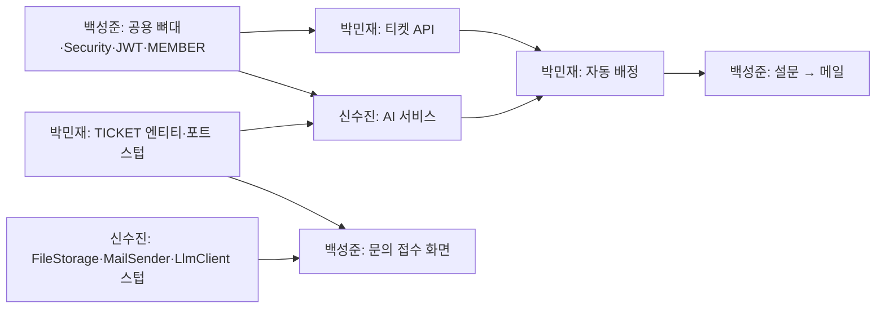

# 06. 로드맵 (2026-09-29 ~ 2026-10-21)

> **수정 규칙:** 자기 이름 섹션의 체크박스만 체크한다. 매 작업 완료 시 **push 전 pull 확인**([01 §3.2](01_collaboration-rules.md#32-push-직전-매번))은 모든 항목의 숨은 마지막 단계다.
> 각 항목은 Shrimp Task Manager의 plan 입력 단위로 사용한다 ([07 가이드](07_shrimp-task-guide.md)).

## 전체 일정

| 스프린트 | 기간 | 목표 | 머지 |
|---|---|---|---|
| **S0** 세팅 | 9/29(화) ~ 10/1(목) | 저장소·공용 뼈대·스키마·포트 스텁 | feature → dev |
| **S1** 핵심 흐름 | 10/2(금) ~ 10/8(목) | 접수 → AI 분류 → 자동 배정 → 답변 → 해결 | 10/8 dev → main **M1** |
| **S2** 필수 완성 | 10/9(금) ~ 10/14(수) | SLA·설문·메일·FAQ/템플릿·대시보드 완성, 통합 테스트 | 10/14 dev → main **M2** |
| **S3** 선택 기능 | 10/15(목) ~ 10/18(일) | 실시간 채팅·이력 묶음·월간 리포트, 버그 수정 | 10/18 dev → main **M3** |
| **S4** 배포·QA | 10/19(월) ~ 10/21(수) | AWS 배포, 시나리오 QA, 발표 자료 | 10/21 dev → main **Final** |

> 공휴일: 10/3(토) 개천절, 10/9(금) 한글날 — 팀 상황에 맞게 작업일 조정
> 매일 1회 짧은 싱크(10분): 어제 한 것 / 오늘 할 것 / 막힌 것 / CR Issue 확인

---

## 의존성 (먼저 끝나야 하는 것)

**S0 종료 조건:** 3명 모두 dev를 받아 `docker compose up` + 백엔드 실행 + 프론트 실행 + 로그인까지 동작, 모든 포트 인터페이스와 스텁이 dev에 존재.

---

## 백성준 (BSJ) — 인증/권한 · 문의 접수 · FAQ/템플릿 · 설문 · 이력 묶음 · 공용

### S0 (9/29 ~ 10/1)
- [x] GitHub 저장소 설정(01 §2.3): Collaborator 초대(`totot03`, `s-sujin-99`), `main`·`dev` 생성 + 기본 브랜치 `dev`, 브랜치 보호 규칙(관리자 우회 금지)
- [x] 3개 repo `.github/CODEOWNERS`, PR 템플릿, `.githooks/pre-push` 추가 — CODEOWNERS는 01 §4.4 그대로 복사
- [x] front: Next.js 프로젝트 생성, Tailwind, **shadcn/ui 초기화 + 08 §5.1 컴포넌트 일괄 설치**, `globals.css` 토큰(퍼플/인디고 임시값 + ai/success/warning/info), Pretendard
- [x] front: 공용 레이아웃(Header·Sidebar·Footer), `config/menu.ts`, `config/badge.ts`, `lib/format.ts`, `lib/api/client.ts`
- [x] front/back: ESLint·Prettier·tsconfig·.editorconfig 공용 설정, `.gitignore`(.shrimp, .mcp.json, .env)
- [x] back: IDE 혼용 대비 설정(10 §3.5) — `.gitignore`(IntelliJ·Eclipse 파일), `.gitattributes`(LF), `pom.xml` UTF-8, Maven Wrapper 포함 확인
- [x] IntelliJ 설정(JDK 21·UTF-8·Lombok·import, 10 §3.5) 후 `./mvnw verify` 성공 확인
- [x] back: Spring Boot 4 / Java 21 / Maven 프로젝트, `global/*`(ApiResponse, ErrorCode, GlobalExceptionHandler, BaseTimeEntity), `docker-compose.yml`, Flyway 설정, `application.yml`(import 구조)
- [x] MEMBER, REFRESH_TOKEN 마이그레이션 + 엔티티, `MemberQueryPort`·`AttachmentPort`·`FaqQueryPort` 인터페이스 + 스텁
- [x] Security + JWT 로그인/회원가입/재발급 API(Refresh httpOnly 쿠키, SameSite=Lax·Path=/), 프론트 로그인 화면 + `AuthGuard`
- [x] `next.config.ts` rewrites(`/api/*` → `BACKEND_ORIGIN`), `server.forward-headers-strategy: framework`, CORS는 `/api/attachments`·`/ws`만 (02 §2.1)
- [x] 시드: 역할별 계정

### S1 (10/2 ~ 10/8)
> S0에서 옮겨 온 항목(①~②)은 **10/2~10/3에 먼저** 끝낸다. 그 전까지 다른 사람은 `components/ui`(shadcn)를 직접 사용하고, 공용 조합 컴포넌트가 머지되면 교체한다.

- [x] ① (S0에서 이동) 공용 조합 컴포넌트(PageHeader, DataTable, EmptyState, ErrorState, LoadingSkeleton, ConfirmDialog, 배지 5종, PlainText) + 샘플 페이지(`/dev/ui`)
- [x] ② (S0에서 이동) `.claude/agents`, `.claude/skills` 폴더와 08 §12 목록 틀 (S0에 생성됨 — agent·skill 추가 시 08 §12 표에 기록)
- [x] 첨부 업로드 API (`FileStorage` 사용, 확장자/용량 검증) + ATTACHMENT
- [x] 문의 접수 페이지(회원/비회원), 첨부 UI, 접수 완료 화면 (박민재 `POST /api/tickets` 연동)
- [x] 비회원 조회(Guest 토큰), 내 문의 목록/상세 페이지 (박민재 타임라인 컴포넌트 사용)
- [x] 관리자 계정 관리(상담원/팀장 생성·역할 변경), 상담원 available 토글
- [x] 회원가입 화면 (CM-02) — API는 S0 완료, 화면이 로드맵에서 빠져 있어 추가
- [x] 공용 `RateLimitFilter`(비회원 문의·첨부·로그인·재설정 요청)
- [x] FAQ 고객 페이지 + 관리 CRUD

### S2 (10/9 ~ 10/14)
- [x] 템플릿 CRUD + `TemplatePicker` 컴포넌트 (박민재에 전달)
- [ ] `SurveyListener`(RESOLVED) → 설문 생성 → 신수진 `MailSender` 호출, 재문의 시 설문 만료·재해결 시 재발급(FR-SRV-06)
- [ ] 설문 페이지 + 제출 → `SurveySubmittedEvent`
- [ ] 접수 폼 FAQ 추천
- [ ] PASSWORD_RESET_TOKEN + 비밀번호 찾기/재설정, 비밀번호 변경·내 정보 수정 (CM-03·04, CU-10)
- [ ] 비회원 조회 비밀번호 재설정 (CU-06, 박민재 `TicketGuestPort` 사용)
- [ ] 설문 결과 조회 API + 화면 (CS-06)
- [ ] 권한별 메뉴/접근 통합 점검

### S3 (10/15 ~ 10/18)
- [ ] 고객 이력 묶음 API + `CustomerHistoryPanel` 컴포넌트, 고객 이력 페이지
- [ ] 반응형/UI 정리(공용 컴포넌트), 버그 수정
- [ ] **최종 디자인 정리**(08 §13): 토큰 값·`components/ui` 스타일·폰트·로고 조정 (10/18~19)

### S4 (10/19 ~ 10/21)
- [ ] prod 환경변수/CORS 설정 지원, 시나리오 QA(고객 흐름), 발표 자료(담당 파트)

---

## 박민재 (PMJ) — 티켓·상태 전이 · 배정 · SLA · 알림(WebSocket) · 채팅

### S0 (9/29 ~ 10/1)
- [x] Eclipse/STS 설정(JDK 21·UTF-8·Lombok·import, 10 §3.5) 후 `./mvnw verify` 성공 확인
- [x] SLA_POLICY, TICKET, TICKET_HISTORY, TICKET_REPLY 마이그레이션 + 엔티티
- [x] `TicketClassificationPort`, `TicketQueryPort`, `NotificationPort` 인터페이스 + 스텁, 이벤트 클래스 4종 정의(`SurveySubmittedEvent` 는 BSJ 발행·소유, 02 §5.1)
- [x] `TicketStateMachine` 전이표 + 단위 테스트
- [x] `TicketGuestPort` 인터페이스 + 스텁

### S1 (10/2 ~ 10/8)
- [x] `POST /api/tickets`(회원/비회원, 티켓번호 생성, SLA due 계산, `TicketCreatedEvent`)
- [x] 고객용 조회/추가 답글 API, `TicketTimeline` 컴포넌트 (백성준에 전달)
- [x] 상담 콘솔 티켓 목록(필터·SLA 임박순) / 상세 페이지
- [x] 상태 변경 API(서비스 계층 검증) + TICKET_HISTORY 기록
- [x] 상담원 답변/내부 메모 API + `ReplyEditor`(일반 텍스트, 5,000자, 템플릿·AI 초안 삽입 슬롯)
- [x] `applyClassification` 구현 + **최소 부하 자동 배정**(비관적 락) + 수동/재배정

### S2 (10/9 ~ 10/14)
- [ ] WebSocket/STOMP 설정 + JWT 인터셉터, `stompClient.ts`
- [ ] NOTIFICATION 저장 + `/user/queue/notifications` 푸시, `NotificationBell` (백성준이 Header 배치)
- [ ] SLA 스케줄러(임박 80%/초과), 목록 SLA 배지, SLA 정책 관리 화면
- [ ] 자동 종료 스케줄러(RESOLVED 72h) + `SurveySubmittedEvent` → CLOSED
- [ ] **고객 답변 알림**: 공개 답변 → 회원 웹 알림(`AGENT_REPLY`) + `MailSender.sendAgentReplyMail` 호출(10분 묶음)
- [ ] `TicketGuestPort` 구현 (비회원 조회 비밀번호 재설정용)
- [ ] 티켓 상세에 신수진·백성준 컴포넌트 통합(AiAnalysisPanel, AiDraftButton, TemplatePicker)

### S3 (10/15 ~ 10/18)
- [ ] CHAT_ROOM/CHAT_MESSAGE, 채팅 요청 → **대기열(WAITING, 순번 푸시)** → 상담원 배정 시 OPEN + CHAT 티켓 생성
- [ ] 대기 5분 초과 안내 → 문의로 남기기(CONVERTED)/나가기(CANCELED)
- [ ] 고객 채팅 화면 / 상담원 채팅 콘솔, 메시지 저장·이전 메시지 로드, 종료 → RESOLVED
- [ ] CHAT 티켓: 상담원 첫 메시지 → `first_responded_at` 기록 + IN_PROGRESS 전환, 이미 배정된 티켓은 `applyClassification` 시 재배정 안 함 (FR-CHT-06)
- [ ] `/topic/console/tickets` 실시간 목록 갱신

### S4 (10/19 ~ 10/21)
- [ ] 운영 환경 WebSocket 연결 확인(프록시/보안그룹), 시나리오 QA(상담원 흐름)

---

## 신수진 (SSJ) — AI 분류·초안 · 대시보드 · 리포트 · AWS 인프라/배포

### S0 (9/29 ~ 10/1)
- [x] Eclipse/STS 설정(JDK 21·UTF-8·Lombok·import, 10 §3.5) 후 `./mvnw verify` 성공 확인
- [x] front·back **GitHub Actions CI** 워크플로(10 §4) 추가 → 첫 실행 성공 시 백성준에게 Required status check 등록 요청
- [x] `FileStorage`(LocalFileStorage), `MailSender`(LogMailSender), `LlmClient`(MockLlmClient) 인터페이스 + 로컬 구현
- [x] TICKET_AI_RESULT, AI_DRAFT, MAIL_LOG 마이그레이션 + 엔티티, `AiResultPort` 스텁
- [x] Spring AI 2.0.1 의존성 추가 요청(CR → 백성준, `spring-ai-bom`), LLM 제공자 후보 비교·선택(PRD Q11) → 팀 공유 후 개발용 키 발급 — **Gemini** 선택, 개발용 키 발급 완료
- [x] AWS 계정/IAM 준비, **SES 샌드박스 해제 요청 또는 테스트 수신자 검증 시작** — SES 도메인 `helpnest.kro.kr` 인증, 프로덕션 액세스 요청 → 승인됨(10/6 확인)
- [x] CloudFront(PRD Q20 ③) 구성 사전 테스트 — 임시 EC2 + CloudFront로 HTTPS API·WSS 연결 확인 (배포 주에 막히지 않도록) — HTTPS 200·WSS 101 확인, 임시 자원 삭제

### S1 (10/2 ~ 10/8)
- [x] `SpringAiLlmClient` + 마스킹 + 타임아웃/재시도 (back #20)
- [x] AI-1 분류 리스너(비동기) → `applyClassification` / 실패 fallback (back #23)
- [x] 분류 조회/재분류 API + `AiAnalysisPanel` 컴포넌트 (back #24, front #7)
- [x] 분류 테스트 샘플 30건 + 정확도 측정 (back #33, 결과 05 §6.1)

### S2 (10/9 ~ 10/14)
- [x] AI-2 답변 초안(FAQ·과거 답변 검색 + 프롬프트) API + `AiDraftButton` (back #55, front #22, 05 §4.4)
- [x] AI-3 결과 메일 템플릿 + MAIL_LOG + 재시도 스케줄러 (back #50·#51·#53, docs #31)
- [x] 메일 추가: `sendAgentReplyMail`, `sendPasswordResetMail` (회원·비회원 공용 템플릿) (back #50·#51)
- [x] 대시보드 API(요약·상담원별·본인) + 대시보드 페이지(KPI 카드, 분포 차트, 상담원 표) (back #57, front #26)

### S3 (10/15 ~ 10/18)
- [x] 월간 리포트 API + 페이지(유형별 건수·전월 대비·처리시간·SLA·만족도·불만 비율) (back #63, front #28) — 만족도는 설문 테이블 머지 후
- [x] 리포트·상담원 처리현황 **CSV 다운로드**(UTF-8 BOM, 수식 주입 방지) (back #65, front #28)
- [x] `S3FileStorage`, `SesMailTransport` 구현(prod 프로필) + 로컬에서 실제 AWS 연결 테스트 (CR back #60→#64, back #69, `AwsLiveTest` 2/2)

### S4 (10/19 ~ 10/21)
- [ ] RDS 생성 + Flyway 적용, EC2 백엔드 배포 + CloudFront(HTTPS/WSS, PRD Q20), 환경변수/비밀값 설정
- [ ] **Amplify**로 프론트 배포: 백성준 계정으로 GitHub 연동 승인 → `helpnest-front` `main` 연결, 환경변수 등록, 백엔드 CORS에 Amplify 도메인 반영
- [ ] S3 버킷·CORS, SES 발신 검증, 운영 스모크 테스트
- [ ] dev → main 최종 머지 진행, 배포 URL/계정 README 기록

---

## 통합 테스트 시나리오 (M2·Final 체크)
- [ ] 비회원 문의(첨부 2개) → 티켓번호 발급 → AI 분류(불만 → 우선순위 상향) → 자동 배정 → 상담원 알림 수신
- [ ] 상담원이 템플릿 + AI 초안으로 답변 → 첫 응답 시간 기록 → 해결 → 결과 메일 + 설문 링크 → 설문 제출 → CLOSED
- [ ] URGENT 티켓 방치 → 48분 임박 알림 → 60분 초과 알림 + 배지
- [ ] 팀장 재배정 → 이력 기록 → 새 상담원 알림
- [ ] 대시보드 수치가 DB 쿼리 결과와 일치
- [ ] 회원 채팅 → 상담원 입장 → 메시지 실시간 송수신 → 종료 (채팅 티켓이 SLA 초과로 잘못 표시되지 않음)
- [ ] 불허 전이(RECEIVED → RESOLVED) API 호출 시 에러
- [ ] 상담원 공개 답변 → 고객 답변 알림 메일(회원은 웹 알림도) 수신, 내부 메모는 알림 없음
- [ ] 비밀번호 찾기 메일 → 재설정 → 새 비밀번호 로그인, 기존 Refresh 토큰 무효
- [ ] 비회원 조회 비밀번호 재설정 → 새 비밀번호로 조회
- [ ] 동일 IP로 비회원 문의 6회 → 429
- [ ] 상담원 모두 OFF 상태에서 채팅 요청 → 대기 순번 표시 → 5분 후 문의로 남기기 → 티켓 생성
- [ ] 설문 결과 화면 필터·요약 수치 확인, 리포트 CSV 엑셀에서 한글 정상
- [ ] 본문에 `<script>` 입력 → 화면에 글자 그대로 표시
- [ ] 해결 → 고객 재문의(IN_PROGRESS) → 기존 설문 링크 만료 확인 → 재해결 → 새 설문 메일 수신
- [ ] 채팅 상담 종료 → RESOLVED 정상 전이(ASSIGNED에서 막히지 않음)
