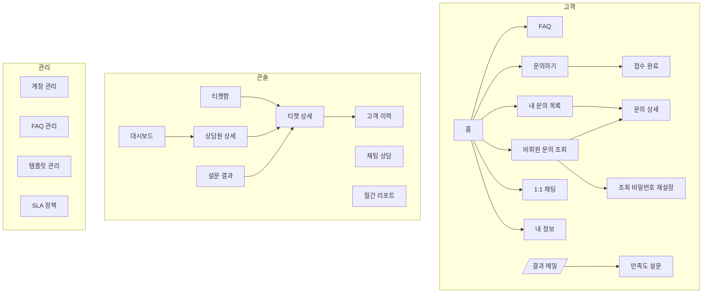

# 09. 화면 명세 (IA)

> 화면 ID 규칙: `CU-`(고객) / `CS-`(콘솔: 상담원·팀장) / `AD-`(관리자) / `CM-`(공통).
> **수정 규칙:** 각 행의 "담당" 본인만 해당 행을 수정한다. 새 화면을 추가하면 자기 행을 추가하고, 사이드바 메뉴가 필요하면 백성준에게 CR.
> 모든 화면은 [디자인 시스템](08_design-system.md)의 레이아웃·상태 패턴(로딩/빈/에러)을 따른다.

## 1. 사이트 맵

## 2. 화면 목록

### 2.1 공통 (백성준)
| ID | 화면 | 경로 | 권한 | 주요 구성 | 사용 API |
|---|---|---|---|---|---|
| CM-01 | 로그인 | `/login` | 공개 | 이메일·비밀번호, 비밀번호 찾기·회원가입·비회원 조회 링크. 로그인 후 역할별 이동(고객 → 홈, 직원 → 티켓함) | `POST /auth/login` |
| CM-02 | 회원가입 | `/signup` | 공개 | 이메일, 비밀번호(확인), 이름, 연락처 | `POST /auth/signup` |
| CM-03 | 비밀번호 찾기 | `/forgot-password` | 공개 | 이메일 입력 → "메일을 확인해 주세요"(계정 유무 무관 동일) | `POST /auth/password/reset-request` |
| CM-04 | 비밀번호 재설정 | `/reset-password?token=` | 공개 | 새 비밀번호(확인), 만료 토큰 안내 | `POST /auth/password/reset` |
| CM-05 | 403 / 404 | - | - | `EmptyState` 기반 안내 + 홈 이동 | - |
| CM-06 | 공용 레이아웃 | `(main)/layout.tsx` | - | Header(알림 벨 슬롯), 역할별 Sidebar, Footer(고객) | `GET /members/me` |

### 2.2 고객
| ID | 화면 | 경로 | 권한 | 담당 | 주요 구성 | 사용 API |
|---|---|---|---|---|---|---|
| CU-01 | 홈 | `/` | 공개 | 백성준 | 검색창(FAQ), 자주 묻는 질문 5개, [문의하기] [채팅 상담 (회원만)] [문의 조회] 카드 | `GET /faqs` |
| CU-02 | FAQ | `/faq` | 공개 | 백성준 | 유형 탭, 키워드 검색, 아코디언, 하단 "해결되지 않았나요? 문의하기" | `GET /faqs` |
| CU-03 | 문의하기 | `/inquiry/new` | 공개 | 백성준 | 유형 선택, 제목(입력 시 FAQ 추천), 본문(5,000자 카운터), 첨부(≤5개·10MB), 비회원 정보(이름·이메일·조회 비밀번호) | `GET /faqs/suggest`, `POST /attachments`, `POST /tickets` |
| CU-04 | 접수 완료 | `/inquiry/complete` | 공개 | 백성준 | 티켓번호, 예상 응답 안내, 비회원은 "티켓번호를 저장해 주세요" | - |
| CU-05 | 비회원 문의 조회 | `/inquiry/lookup` | 공개 | 백성준 | 티켓번호·이메일·조회 비밀번호, [조회 비밀번호 재설정] 링크 | `POST /auth/guest` |
| CU-06 | 조회 비밀번호 재설정 | `/inquiry/lookup/reset` | 공개 | 백성준 | ①티켓번호·이메일 → 메일 발송 ②`?token=` 새 비밀번호 | `POST /auth/guest/reset-request`, `/reset` |
| CU-07 | 문의 상세 | `/my/inquiries/[id]` | 본인/Guest (비회원은 CU-05 조회 성공 후 이 화면으로 이동 — `AuthGuard`가 Guest 토큰 허용) | 백성준 (타임라인 `TicketTimeline`은 박민재) | 상태 배지, 본문·첨부, 답변 타임라인, 추가 답글 입력, 해결 상태면 "재문의" 안내 | `GET /tickets/{id}`, `POST /tickets/{id}/replies` |
| CU-08 | 내 문의 목록 | `/my/inquiries` | CUSTOMER | 백성준 | 상태 필터, 목록(티켓번호, 제목, 상태, 최근 답변일) | `GET /tickets/my` |
| CU-09 | 1:1 채팅 | `/chat` | CUSTOMER | 박민재 | 대기 화면(순번·경과시간) → 5분 초과 시 [문의로 남기기][계속 기다리기][나가기] → 상담 화면(메시지, 상담원 이름) → 종료 | `POST/DELETE /chat/rooms`, `/convert`, STOMP |
| CU-10 | 내 정보 | `/my/profile` | 로그인 | 백성준 | 이름·연락처 수정, 비밀번호 변경(현재/새/확인) | `PATCH /members/me`, `/password` |
| CU-11 | 만족도 설문 | `/survey/[token]` | 토큰 | 백성준 | 티켓 제목, 별점 5개, 의견, 제출 후 감사 화면, 만료·제출 완료 안내 | `GET/POST /surveys/{token}` |

### 2.3 콘솔 (상담원·팀장)
| ID | 화면 | 경로 | 권한 | 담당 | 주요 구성 | 사용 API |
|---|---|---|---|---|---|---|
| CS-01 | 티켓함 | `/console/tickets` | AGENT+ | 박민재 | 탭(내 티켓/미배정/전체*), 필터(상태·우선순위·유형·SLA), 키워드 검색(번호·제목·본문, 300ms 디바운스), 표(번호, 제목, 고객, 유형, 우선순위, 불만, 상태, SLA, 담당, 접수일), 20행 서버 페이지네이션. **탭·필터·페이지는 URL 쿼리에 보존**한다(상세에서 뒤로가기 복원·링크 공유). 담당자는 별도 필터가 아니라 탭이 번역한다(내 티켓 → `agentId`, 미배정 → `unassigned=true`). 실시간 "새 티켓" 배너는 S2 (상담 가능 ON/OFF 토글은 Header에 있음 — 백성준) | `GET /console/tickets`, STOMP `/topic/console/tickets`(S2) |
| CS-02 | 티켓 상세 | `/console/tickets/[id]` | AGENT+ | 박민재 | 좌: 본문·첨부, `TicketTimeline`(`showInternal`), `ReplyEditor`(일반 텍스트 5,000자, [내부 메모] 토글, `toolbarSlot` 에 [템플릿] [AI 초안] 주입 — S2) / 우: SLA, 상태 변경, 배정(LEAD+), 상태 이력, `AiAnalysisPanel`(신수진, S2), `CustomerHistoryPanel`(백성준, S2). **전이 가능 여부는 프론트가 판정하지 않고** 서버의 `TICKET_INVALID_TRANSITION` 문구를 토스트로 보여 준다. 1024px 미만은 1단 | `GET /console/tickets/{id}`, `/histories`, `/status`, `/assign`, `/assign/auto`, `/replies`, `GET /console/agents`(배정 드롭다운) |
| CS-03 | 채팅 상담 | `/console/chat` | AGENT | 박민재 | 좌: 내 채팅방 목록(대기/상담중) / 우: 대화창, 고객 정보, [템플릿] [종료·해결] | `GET /chat/rooms`, STOMP |
| CS-04 | 대시보드 | `/console/dashboard` | AGENT(본인), LEAD+ | 신수진 | 기간 필터, KPI 카드(전체·미배정·SLA 위반율·평균 첫 응답·평균 만족도), 상태/유형 분포 차트, 상담원별 표 + [CSV] | `GET /dashboard/*`, `/agents/export` |
| CS-05 | 월간 리포트 | `/console/reports` | LEAD+ | 신수진 | 월 선택, 유형별 건수(전월 대비), 처리시간, SLA, 만족도, 불만 비율 차트·표 + [CSV 다운로드] | `GET /reports/monthly`, `/export` |
| CS-06 | 설문 결과 | `/console/surveys` | AGENT(본인), LEAD+ | 백성준 | 요약 카드(응답률·평균 별점·별점 분포), 필터(**발송 기간**·별점·상담원(LEAD+만)·유형 — 값은 URL 쿼리에 보존, 요약은 별점 필터를 받지 않음), 표(티켓번호, 고객, 상담원, 별점, 의견(`PlainText`), 제출일) → 행 클릭 시 CS-02. AGENT 는 서버가 본인 담당분으로 고정 | `GET /console/surveys`, `/summary` |
| CS-07 | 고객 이력 | `/console/customers/[key]` | AGENT+ | 백성준 | 고객 정보, 총 문의 수, 평균 만족도, 문의 목록 | `GET /console/customers/{key}/tickets` |
| CS-08 | 알림 패널 | Header 드롭다운 | 로그인 | 박민재 | 미읽음 수, 최근 20개, 모두 읽음 | `GET /notifications`, STOMP |
| CS-09 | 상담원 상세 | `/console/agents/[id]` | LEAD+ | 백성준 | CS-04 상담원 표에서 진입. 기간 필터(기본 7일), KPI 카드(본인 값 + **팀 평균** 보조 문구), 일별 접수·해결 막대, 유형·우선순위별 건수·평균 해결·SLA 위반율, 최근 담당 티켓·설문 20건 → 행 클릭 시 CS-02 | `GET /dashboard/agents/{id}/detail` |

`*` 전체 탭은 LEAD+만

### 2.4 관리
| ID | 화면 | 경로 | 권한 | 담당 | 주요 구성 | 사용 API |
|---|---|---|---|---|---|---|
| AD-01 | 계정 관리 | `/admin/members` | ADMIN | 백성준 | 역할 필터, 표, [계정 생성] 다이얼로그, 역할·상태 변경 | `/admin/members` |
| AD-02 | FAQ 관리 | `/admin/faq` | LEAD+ | 백성준 | 표(유형, 질문, 공개, 조회수), 작성/수정 다이얼로그 | `/admin/faqs` |
| AD-03 | 템플릿 관리 | `/admin/templates` | LEAD+ | 백성준 | 표, 작성/수정(치환 변수 안내 `{고객명}` `{티켓번호}`) | `/admin/templates` |
| AD-04 | SLA 정책 | `/admin/sla` | LEAD(조회), ADMIN(수정) | 박민재 | 우선순위별 기한(분)·임박 비율 편집 | `/admin/sla-policies` |

## 3. 주요 사용자 흐름

### 3.1 비회원 문의 → 해결
`CU-03 문의하기` → `CU-04 접수 완료(티켓번호)` → (상담원 답변) **답변 알림 메일** → 메일 링크 → `CU-05 조회` → `CU-07 상세` → (해결) **결과 메일** → `CU-11 설문`

### 3.2 상담원 처리
`CS-08 알림(신규 배정)` → `CS-02 상세` → AI 분석 확인 → [AI 초안] → 편집 → 공개 답변(IN_PROGRESS, 첫 응답 기록) → [해결] 확인 다이얼로그 → RESOLVED

### 3.3 채팅
`CU-09` 요청 → 대기(순번 표시) → 상담원 연결 → 대화 → 종료(RESOLVED) / 5분 초과 → [문의로 남기기] → 티켓번호 안내

## 4. 공용 컴포넌트 주입 위치 (다른 담당자 컴포넌트를 쓰는 화면)
| 화면(소유) | 들어가는 컴포넌트(소유) |
|---|---|
| CS-02 티켓 상세(박민재) | `AiAnalysisPanel`, `AiDraftButton`(신수진), `TemplatePicker`, `CustomerHistoryPanel`(백성준) |
| CU-07 문의 상세(백성준) | `TicketTimeline`(박민재) |
| CS-03 채팅 상담(박민재) | `TemplatePicker`(백성준) |
| Header(백성준) | `NotificationBell`(박민재) |
| CS-09 상담원 상세(백성준) | `KpiGrid`, `formatHours`·`formatRating`(신수진 대시보드) |
